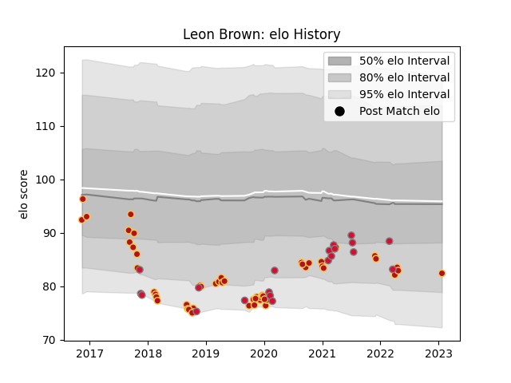

---  
layout: page  
title: Leon Brown  
date: 2023-01-30 17:52:35.987138  
categories: player  
---
# Leon Brown

## Positions: P

## Country: Wales

## Current elo: 82.0

## Current Percentile: 15.0

# Elo History

# Match History

| Team    |   Appearances |   Win Rate |
|:--------|--------------:|-----------:|
| Dragons |            54 |   0.342593 |
| Wales   |            20 |   0.475    |

| Opponent           |   Matches |   Win Rate |
|:-------------------|----------:|-----------:|
| Scarlets           |         7 |   0.571429 |
| Edinburgh          |         6 |   0.333333 |
| Ospreys            |         5 |   0.3      |
| Southern Kings     |         4 |   0.625    |
| Leinster           |         4 |   0        |
| Cardiff Blues      |         4 |   0        |
| Italy              |         3 |   0.666667 |
| Ireland            |         3 |   0.333333 |
| Glasgow Warriors   |         3 |   0.5      |
| England            |         3 |   0.333333 |
| Worcester Warriors |         3 |   0.333333 |
| France             |         2 |   0        |
| Castres Olympique  |         2 |   0.5      |
| Scotland           |         2 |   1        |
| Benetton Treviso   |         2 |   0        |
| RC Enisei          |         2 |   1        |
| Argentina          |         2 |   0.25     |
| Timisoara Saracens |         1 |   1        |
| Northampton Saints |         1 |   0        |
| Sharks             |         1 |   0        |
| Tonga              |         1 |   1        |
| Ulster             |         1 |   0        |
| Leicester Tigers   |         1 |   0        |
| New Zealand        |         1 |   0        |
| Munster            |         1 |   0        |
| Lions              |         1 |   0        |
| Australia          |         1 |   0        |
| Georgia            |         1 |   1        |
| Connacht           |         1 |   1        |
| Cheetahs           |         1 |   0        |
| Canada             |         1 |   1        |
| Bulls              |         1 |   0        |
| Bristol Rugby      |         1 |   0        |
| Zebre              |         1 |   1        |