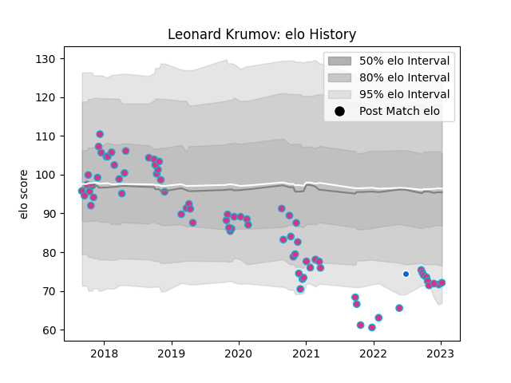

---  
layout: page  
title: Leonard Krumov  
date: 2022-12-18 16:39:38.562273  
categories: player  
---
# Leonard Krumov

## Positions: L

## Country: Italy

## Current elo: 72.0

## Current Percentile: 2.0

# Elo History

# Match History

| Team   |   Appearances |   Win Rate |
|:-------|--------------:|-----------:|
| Zebre  |            72 |     0.1875 |
| Italy  |             1 |     1      |

| Opponent             |   Matches |   Win Rate |
|:---------------------|----------:|-----------:|
| Munster              |         8 |   0        |
| Ulster               |         7 |   0.142857 |
| Benetton Treviso     |         6 |   0.5      |
| Edinburgh            |         5 |   0.2      |
| Ospreys              |         5 |   0.4      |
| Leinster             |         5 |   0        |
| Bristol Rugby        |         4 |   0.25     |
| Cardiff Blues        |         4 |   0        |
| Connacht             |         4 |   0.25     |
| Glasgow Warriors     |         4 |   0        |
| Scarlets             |         3 |   0        |
| Stade Francais Paris |         2 |   0.5      |
| Pau                  |         2 |   0        |
| Agen                 |         2 |   0.5      |
| Dragons              |         2 |   0        |
| Cheetahs             |         2 |   0        |
| Gloucester Rugby     |         2 |   0        |
| Lions                |         1 |   0        |
| Namibia              |         1 |   1        |
| Bayonne              |         1 |   0.5      |
| Sharks               |         1 |   0        |
| Southern Kings       |         1 |   1        |
| Brive                |         1 |   1        |