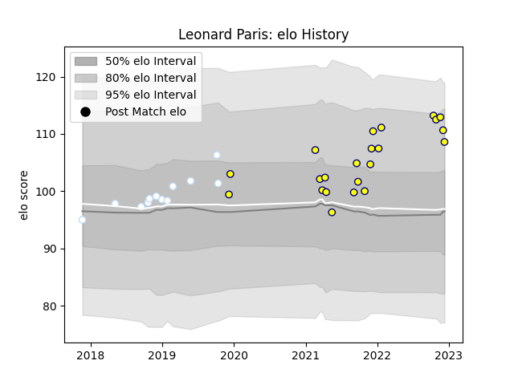

---  
layout: page  
title: Leonard Paris  
date: 2022-12-18 16:16:26.101979  
categories: player  
---
# Leonard Paris

## Positions: C

## Current elo: 112.0

## Current Percentile: 83.0

# Elo History

# Match History

| Team      |   Appearances |   Win Rate |
|:----------|--------------:|-----------:|
| Nevers    |            23 |   0.434783 |
| Racing 92 |            12 |   0.541667 |

| Opponent          |   Matches |   Win Rate |
|:------------------|----------:|-----------:|
| Agen              |         5 |   0.9      |
| Beziers           |         3 |   0.666667 |
| Colomiers         |         2 |   0        |
| Pau               |         2 |   1        |
| Oyonnax           |         2 |   0        |
| Aurillac          |         2 |   0.5      |
| Mont-de-Marsan    |         2 |   0.5      |
| Carcassonne       |         2 |   0        |
| Vannes            |         2 |   0.25     |
| Castres Olympique |         1 |   0        |
| Grenoble          |         1 |   0        |
| La Rochelle       |         1 |   0        |
| Lyon              |         1 |   0        |
| Montauban         |         1 |   1        |
| Bordeaux Begles   |         1 |   0        |
| Bayonne           |         1 |   0.5      |
| Provence Rugby    |         1 |   0        |
| Rouen             |         1 |   1        |
| Stade Toulousain  |         1 |   0        |
| Toulon            |         1 |   1        |
| US Bressane       |         1 |   1        |
| Ulster            |         1 |   1        |