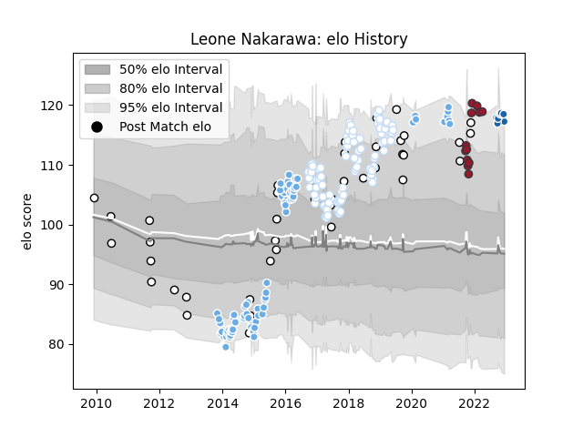

---  
layout: page  
title: Leone Nakarawa  
date: 2022-12-09 13:15:20.779244  
categories: player  
---
# Leone Nakarawa

## Positions: L, N8

## Country: Fiji

## Current elo: 118.0

## Current Percentile: 91.0

# Elo History

# Match History

| Team              |   Appearances |   Win Rate |
|:------------------|--------------:|-----------:|
| Racing 92         |            86 |   0.575581 |
| Glasgow Warriors  |            78 |   0.685897 |
| Fiji              |            41 |   0.402439 |
| Toulon            |            12 |   0.458333 |
| Castres Olympique |             7 |   0.571429 |

| Opponent                 |   Matches |   Win Rate |
|:-------------------------|----------:|-----------:|
| Castres Olympique        |        10 |   0.5      |
| Ulster                   |         9 |   0.555556 |
| Stade Francais Paris     |         9 |   0.555556 |
| Munster                  |         9 |   0.777778 |
| Lyon                     |         8 |   0.375    |
| La Rochelle              |         8 |   0.3125   |
| Stade Toulousain         |         7 |   0.285714 |
| Scarlets                 |         7 |   1        |
| Pau                      |         7 |   0.642857 |
| Brive                    |         7 |   0.714286 |
| Cardiff Blues            |         7 |   0.714286 |
| Montpellier Herault      |         7 |   0.714286 |
| Dragons                  |         7 |   0.571429 |
| Edinburgh                |         7 |   0.571429 |
| Ospreys                  |         6 |   0.75     |
| Leinster                 |         6 |   0.333333 |
| Zebre                    |         6 |   1        |
| Clermont Auvergne        |         6 |   0.666667 |
| Bordeaux Begles          |         5 |   0.8      |
| Toulon                   |         5 |   0.4      |
| Benetton Treviso         |         5 |   1        |
| Leicester Tigers         |         5 |   0.8      |
| Connacht                 |         5 |   0.6      |
| Wales                    |         4 |   0        |
| Perpignan                |         4 |   0.5      |
| Uruguay                  |         3 |   0.666667 |
| Tonga                    |         3 |   0.666667 |
| Scotland                 |         3 |   0.333333 |
| Racing 92                |         3 |   0.333333 |
| Agen                     |         3 |   0.666667 |
| England                  |         3 |   0        |
| Australia                |         3 |   0        |
| Glasgow Warriors         |         2 |   0        |
| Ireland                  |         2 |   0        |
| Bath Rugby               |         2 |   0.5      |
| New Zealand              |         2 |   0        |
| Samoa                    |         2 |   0        |
| Grenoble                 |         2 |   0.5      |
| France                   |         2 |   0.5      |
| Bayonne                  |         2 |   1        |
| Georgia                  |         2 |   0.75     |
| Oyonnax                  |         2 |   1        |
| Canada                   |         2 |   1        |
| Northampton Saints       |         2 |   0        |
| New Zealand Maori        |         2 |   0.5      |
| Italy                    |         2 |   0.5      |
| United States of America |         1 |   1        |
| Namibia                  |         1 |   1        |
| Japan                    |         1 |   1        |
| Spain                    |         1 |   1        |
| South Africa             |         1 |   0        |
| Exeter Chiefs            |         1 |   1        |
| Sale Sharks              |         1 |   1        |
| Romania                  |         1 |   1        |
| Biarritz Olympique       |         1 |   1        |