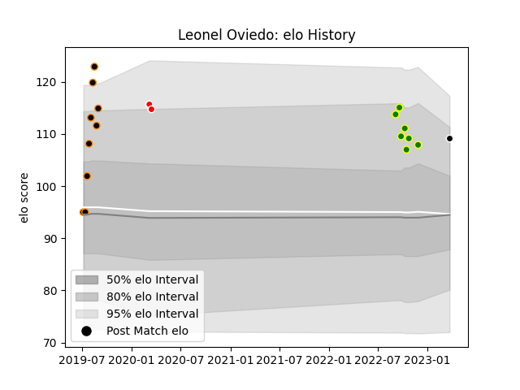

---  
layout: page  
title: Leonel Oviedo  
date: 2023-03-24 11:48:27.494722  
categories: player  
---
# Leonel Oviedo

Last updated: 2023-03-24
## Positions: H

## Current elo: 109.0

## Current Percentile: 84.0

# Elo History

# Match History

| Team                |   Appearances |   Win Rate |
|:--------------------|--------------:|-----------:|
| Jaguares XV         |             9 |   1        |
| Carqueiranne-Hyères |             7 |   0.428571 |
| Ceibos Rugby        |             2 |   1        |
| Provence Rugby      |             1 |   1        |

| Opponent                   |   Matches |   Win Rate |
|:---------------------------|----------:|-----------:|
| Griffons                   |         2 |          1 |
| Valke                      |         2 |          1 |
| Border Bulldogs            |         1 |          1 |
| Bourgoin-Jallieu           |         1 |          0 |
| Chambery                   |         1 |          1 |
| Colomiers                  |         1 |          1 |
| Dax                        |         1 |          0 |
| Eastern Province Kings     |         1 |          1 |
| Boland Cavaliers           |         1 |          1 |
| Leopards                   |         1 |          1 |
| Olimpia Lions              |         1 |          1 |
| SWD Eagles                 |         1 |          1 |
| Selknam                    |         1 |          1 |
| Tarbes                     |         1 |          1 |
| US Bressane                |         1 |          0 |
| Valence Romans Drome Rugby |         1 |          0 |
| Albi                       |         1 |          1 |