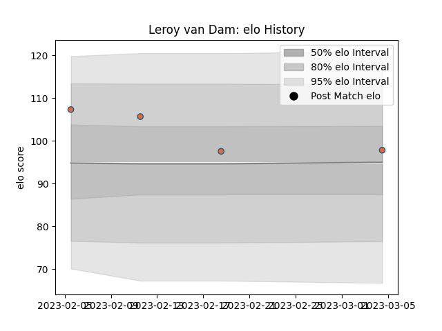

---  
layout: page  
title: Leroy Van Dam  
date: 2023-02-05 15:13:14.877485  
categories: player  
---
# Leroy Van Dam

## Positions: W, FB

## Country: Netherlands

## Current elo: 74.0

## Current Percentile: None

# Elo History

# Match History

| Team          |   Appearances |   Win Rate |
|:--------------|--------------:|-----------:|
| Jersey        |            28 |   0.5      |
| Aurillac      |            19 |   0.394737 |
| Bay of Plenty |            11 |   0.272727 |
| Otago         |             6 |   0.5      |
| Manawatu      |             5 |   0.4      |
| Netherlands   |             1 |   0        |

| Opponent                   |   Matches |   Win Rate |
|:---------------------------|----------:|-----------:|
| Tasman                     |         4 |   0        |
| Yorkshire Carnegie         |         3 |   1        |
| Otago                      |         3 |   0.333333 |
| Cornish Pirates            |         3 |   0.666667 |
| Northland                  |         3 |   0.333333 |
| Bedford                    |         3 |   0.333333 |
| Ealing Trailfinders        |         3 |   0        |
| Hartpury College           |         3 |   0.666667 |
| London Scottish            |         3 |   0        |
| London Irish               |         2 |   0.5      |
| Vannes                     |         2 |   0        |
| Taranaki                   |         2 |   0.5      |
| Nottingham                 |         2 |   0.5      |
| Manawatu                   |         2 |   0.5      |
| Auckland                   |         2 |   0.5      |
| Nevers                     |         2 |   0.5      |
| Doncaster                  |         2 |   1        |
| Coventry                   |         2 |   0.5      |
| Colomiers                  |         2 |   0.5      |
| Carcassonne                |         2 |   0.5      |
| Canterbury                 |         2 |   0        |
| Rouen                      |         1 |   1        |
| Waikato                    |         1 |   0        |
| Beziers                    |         1 |   1        |
| Valence Romans Drome Rugby |         1 |   0        |
| Biarritz Olympique         |         1 |   0        |
| Spain                      |         1 |   0        |
| Soyaux-Angouleme           |         1 |   0        |
| Southland                  |         1 |   1        |
| Hawke's Bay                |         1 |   1        |
| Richmond                   |         1 |   1        |
| Grenoble                   |         1 |   1        |
| Perpignan                  |         1 |   0.5      |
| Oyonnax                    |         1 |   1        |
| North Harbour              |         1 |   1        |
| Newcastle Falcons          |         1 |   0        |
| Montauban                  |         1 |   0        |
| Mont-de-Marsan             |         1 |   0        |
| Provence Rugby             |         1 |   0        |