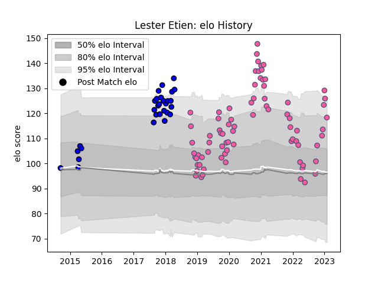

---  
layout: page  
title: Lester Etien  
date: 2022-12-09 13:21:39.119450  
categories: player  
---
# Lester Etien

## Positions: W

## Current elo: 120.0

## Current Percentile: 93.0

# Elo History

# Match History

| Team                 |   Appearances |   Win Rate |
|:---------------------|--------------:|-----------:|
| Stade Francais Paris |            72 |   0.451389 |
| Massy                |            27 |   0.444444 |

| Opponent            |   Matches |   Win Rate |
|:--------------------|----------:|-----------:|
| La Rochelle         |         9 |   0.555556 |
| Pau                 |         7 |   0.571429 |
| Bayonne             |         6 |   0.333333 |
| Stade Toulousain    |         6 |   0.666667 |
| Toulon              |         5 |   0.4      |
| Perpignan           |         5 |   0.8      |
| Agen                |         5 |   0.6      |
| Bordeaux Begles     |         5 |   0.2      |
| Montpellier Herault |         4 |   0.125    |
| Lyon                |         4 |   0        |
| Biarritz Olympique  |         4 |   0.5      |
| Racing 92           |         3 |   0.333333 |
| Carcassonne         |         3 |   0.666667 |
| Mont-de-Marsan      |         3 |   0.333333 |
| Brive               |         3 |   0.333333 |
| Grenoble            |         3 |   0.666667 |
| Dax                 |         3 |   0.333333 |
| Clermont Auvergne   |         3 |   0        |
| Castres Olympique   |         3 |   0.666667 |
| Aurillac            |         2 |   0.5      |
| Ospreys             |         2 |   0.5      |
| Soyaux-Angouleme    |         2 |   0.5      |
| Montauban           |         1 |   0        |
| Connacht            |         1 |   0        |
| Narbonne            |         1 |   1        |
| Bristol Rugby       |         1 |   0        |
| Bourgoin-Jallieu    |         1 |   0        |
| Colomiers           |         1 |   1        |
| Vannes              |         1 |   1        |
| Worcester Warriors  |         1 |   0        |
| Zebre               |         1 |   1        |