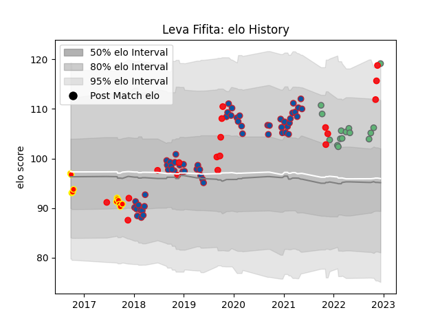

---  
layout: page  
title: Leva Fifita  
date: 2022-12-14 11:31:22.307534  
categories: player  
---
# Leva Fifita

## Positions: L

## Country: Tonga

## Current elo: 119.0

## Current Percentile: 94.0

# Elo History

# Match History

| Team     |   Appearances |   Win Rate |
|:---------|--------------:|-----------:|
| Grenoble |            59 |   0.516949 |
| Tonga    |            18 |   0.333333 |
| Connacht |            15 |   0.466667 |
| Waikato  |            12 |   0.333333 |

| Opponent                   |   Matches |   Win Rate |
|:---------------------------|----------:|-----------:|
| Perpignan                  |         5 |   0.4      |
| Montauban                  |         4 |   0.625    |
| Nevers                     |         4 |   0.75     |
| Biarritz Olympique         |         4 |   0.125    |
| Beziers                    |         3 |   1        |
| Oyonnax                    |         3 |   0.666667 |
| Colomiers                  |         3 |   0.333333 |
| Agen                       |         2 |   0.25     |
| Montpellier Herault        |         2 |   0.5      |
| Northland                  |         2 |   0        |
| Pau                        |         2 |   0        |
| Romania                    |         2 |   0.5      |
| Provence Rugby             |         2 |   0.5      |
| Lyon                       |         2 |   0        |
| Scarlets                   |         2 |   1        |
| Soyaux-Angouleme           |         2 |   0.5      |
| Stade Francais Paris       |         2 |   0.5      |
| Toulon                     |         2 |   0.5      |
| Ulster                     |         2 |   0        |
| Wales                      |         2 |   0        |
| Mont-de-Marsan             |         2 |   1        |
| Wellington                 |         2 |   0.5      |
| Fiji                       |         2 |   0.5      |
| Aurillac                   |         2 |   0.5      |
| Counties Manukau           |         2 |   0.5      |
| Bulls                      |         2 |   0.5      |
| England                    |         2 |   0        |
| Carcassonne                |         2 |   1        |
| United States of America   |         1 |   1        |
| Uruguay                    |         1 |   1        |
| Benetton Treviso           |         1 |   1        |
| Tasman                     |         1 |   0        |
| Stormers                   |         1 |   1        |
| Castres Olympique          |         1 |   0        |
| Valence Romans Drome Rugby |         1 |   1        |
| Stade Toulousain           |         1 |   0        |
| Bordeaux Begles            |         1 |   1        |
| Spain                      |         1 |   1        |
| Vannes                     |         1 |   1        |
| Sharks                     |         1 |   0        |
| Scotland                   |         1 |   0        |
| Canterbury                 |         1 |   0        |
| Auckland                   |         1 |   1        |
| Georgia                    |         1 |   0        |
| Clermont Auvergne          |         1 |   0.5      |
| Chile                      |         1 |   1        |
| Manawatu                   |         1 |   0        |
| Harlequins                 |         1 |   1        |
| Hawke's Bay                |         1 |   1        |
| Japan                      |         1 |   0        |
| La Rochelle                |         1 |   0        |
| Leinster                   |         1 |   0        |
| Lions                      |         1 |   1        |
| France                     |         1 |   0        |
| Argentina                  |         1 |   0        |
| Glasgow Warriors           |         1 |   0        |
| Edinburgh                  |         1 |   0        |
| Narbonne                   |         1 |   0.5      |
| Dragons                    |         1 |   0        |
| New Zealand                |         1 |   0        |
| Newcastle Falcons          |         1 |   1        |
| North Harbour              |         1 |   0        |
| Dax                        |         1 |   1        |
| Massy                      |         1 |   0        |