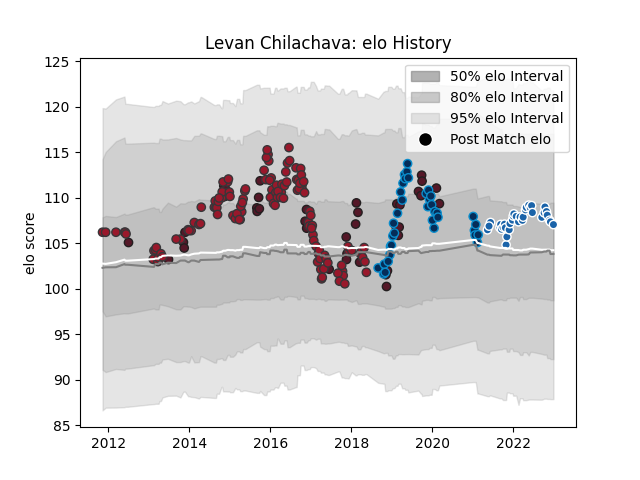

---  
layout: page  
title: Levan Chilachava  
date: 2022-12-09 13:07:38.461427  
categories: player  
---
# Levan Chilachava

## Positions: P

## Country: Georgia

## Current elo: 110.0

## Current Percentile: None

# Elo History

# Match History

| Team                |   Appearances |   Win Rate |
|:--------------------|--------------:|-----------:|
| Toulon              |           114 |   0.605263 |
| Montpellier Herault |            37 |   0.459459 |
| Castres Olympique   |            33 |   0.681818 |
| Georgia             |            27 |   0.62963  |

| Opponent                 |   Matches |   Win Rate |
|:-------------------------|----------:|-----------:|
| Clermont Auvergne        |        16 |   0.5625   |
| Montpellier Herault      |        13 |   0.538462 |
| Stade Toulousain         |        12 |   0.333333 |
| Racing 92                |        12 |   0.25     |
| Lyon                     |        12 |   0.458333 |
| Bordeaux Begles          |        11 |   0.318182 |
| Brive                    |        11 |   0.636364 |
| Pau                      |        10 |   0.9      |
| La Rochelle              |        10 |   0.35     |
| Grenoble                 |         8 |   0.6875   |
| Stade Francais Paris     |         8 |   0.4375   |
| Castres Olympique        |         8 |   0.75     |
| Bayonne                  |         7 |   0.714286 |
| Agen                     |         5 |   0.8      |
| Scarlets                 |         4 |   0.75     |
| Perpignan                |         4 |   0.875    |
| Wasps                    |         3 |   0.666667 |
| Newcastle Falcons        |         3 |   0.333333 |
| Spain                    |         3 |   1        |
| Toulon                   |         3 |   0.833333 |
| Leinster                 |         3 |   1        |
| Bath Rugby               |         3 |   1        |
| Saracens                 |         2 |   0        |
| Scotland                 |         2 |   0        |
| Belgium                  |         2 |   1        |
| Biarritz Olympique       |         2 |   1        |
| Oyonnax                  |         2 |   1        |
| Tonga                    |         2 |   1        |
| Samoa                    |         2 |   1        |
| Canada                   |         2 |   0.5      |
| Leicester Tigers         |         2 |   1        |
| United States of America |         2 |   1        |
| Wales                    |         2 |   0        |
| Glasgow Warriors         |         2 |   1        |
| Sale Sharks              |         2 |   1        |
| Ulster                   |         1 |   1        |
| Uruguay                  |         1 |   1        |
| Fiji                     |         1 |   0        |
| Russia                   |         1 |   1        |
| Romania                  |         1 |   1        |
| Benetton Treviso         |         1 |   1        |
| Germany                  |         1 |   1        |
| Petrarca Padova          |         1 |   1        |
| New Zealand              |         1 |   0        |
| Argentina                |         1 |   0        |
| Connacht                 |         1 |   1        |
| Japan                    |         1 |   0        |
| Italy                    |         1 |   0        |
| Edinburgh                |         1 |   0        |
| Gloucester Rugby         |         1 |   1        |
| Portugal                 |         1 |   1        |