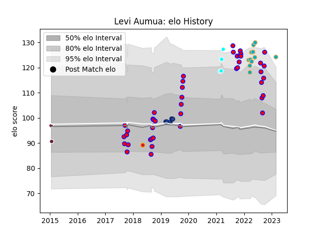

---  
layout: page  
title: Levi Aumua  
date: 2023-03-02 11:26:43.757686  
categories: player  
---
# Levi Aumua

## Positions: C

## Current elo: 124.0

## Current Percentile: 96.0

# Elo History

# Match History

| Team                             |   Appearances |   Win Rate |
|:---------------------------------|--------------:|-----------:|
| Tasman                           |            43 |   0.674419 |
| Moana Pasifika                   |            11 |   0.181818 |
| Blues                            |             5 |   0.4      |
| Toyota Industries Shuttles Aichi |             4 |   1        |
| Bordeaux Begles                  |             2 |   0.5      |
| Chiefs                           |             1 |   0        |

| Opponent                 |   Matches |   Win Rate |
|:-------------------------|----------:|-----------:|
| Auckland                 |         6 |   0.666667 |
| Canterbury               |         5 |   0.2      |
| Waikato                  |         5 |   0.4      |
| Hawke's Bay              |         4 |   0.5      |
| Wellington               |         4 |   1        |
| Otago                    |         3 |   0.666667 |
| Taranaki                 |         3 |   1        |
| North Harbour            |         3 |   0.666667 |
| Southland                |         3 |   1        |
| Manawatu                 |         2 |   1        |
| Hurricanes               |         2 |   0.5      |
| Highlanders              |         2 |   0.5      |
| Northland                |         2 |   1        |
| Crusaders                |         2 |   0        |
| Counties Manukau         |         2 |   0.5      |
| Chiefs                   |         2 |   0        |
| Brumbies                 |         2 |   0.5      |
| Skyactivs Hiroshima      |         1 |   1        |
| Queensland Reds          |         1 |   0        |
| Sunwolves                |         1 |   1        |
| Jaguares                 |         1 |   0        |
| New South Wales Waratahs |         1 |   0        |
| Melbourne Rebels         |         1 |   0        |
| London Welsh             |         1 |   1        |
| Bay of Plenty            |         1 |   1        |
| Hanazono Kintetsu Liners |         1 |   1        |
| Fijian Drua              |         1 |   0        |
| Edinburgh                |         1 |   0        |
| Coca-Cola Red Sparks     |         1 |   1        |
| Chugoku Red Regulions    |         1 |   1        |
| Western Force            |         1 |   0        |