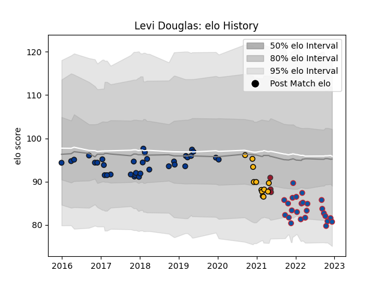

---  
layout: page  
title: Levi Douglas  
date: 2023-01-13 11:28:14.618753  
categories: player  
---
# Levi Douglas

## Positions: L

## Current elo: 76.0

## Current Percentile: 7.0

# Elo History

# Match History

| Team            |   Appearances |   Win Rate |
|:----------------|--------------:|-----------:|
| Bath Rugby      |            35 |   0.585714 |
| Grenoble        |            27 |   0.37037  |
| Wasps           |            12 |   0.416667 |
| Toulon          |             3 |   0.333333 |
| London Scottish |             2 |   1        |

| Opponent            |   Matches |   Win Rate |
|:--------------------|----------:|-----------:|
| Newcastle Falcons   |         6 |   0.333333 |
| Worcester Warriors  |         5 |   1        |
| Leicester Tigers    |         5 |   0.6      |
| Harlequins          |         4 |   0.25     |
| Gloucester Rugby    |         4 |   0.375    |
| Bristol Rugby       |         4 |   0.5      |
| Sale Sharks         |         4 |   0.5      |
| Nevers              |         3 |   0.833333 |
| Aurillac            |         3 |   0.666667 |
| London Irish        |         3 |   0.666667 |
| Provence Rugby      |         3 |   0.166667 |
| Exeter Chiefs       |         3 |   0        |
| Colomiers           |         3 |   0        |
| Clermont Auvergne   |         2 |   0        |
| Carcassonne         |         2 |   0.5      |
| Mont-de-Marsan      |         2 |   0.5      |
| Vannes              |         2 |   0        |
| Narbonne            |         2 |   0.75     |
| Beziers             |         2 |   0        |
| Saracens            |         2 |   0.5      |
| Oyonnax             |         2 |   0        |
| Toulon              |         1 |   1        |
| Wasps               |         1 |   1        |
| Stade Toulousain    |         1 |   1        |
| Agen                |         1 |   1        |
| Montpellier Herault |         1 |   0        |
| Rotherham Titans    |         1 |   1        |
| Ospreys             |         1 |   1        |
| Northampton Saints  |         1 |   1        |
| Montauban           |         1 |   0.5      |
| Brive               |         1 |   1        |
| Bayonne             |         1 |   0        |
| Bath Rugby          |         1 |   1        |
| Yorkshire Carnegie  |         1 |   1        |