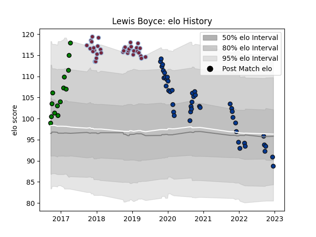

---  
layout: page  
title: Lewis Boyce  
date: 2022-12-14 11:32:41.267075  
categories: player  
---
# Lewis Boyce

## Positions: P

## Current elo: 91.0

## Current Percentile: 33.0

# Elo History

# Match History

| Team               |   Appearances |   Win Rate |
|:-------------------|--------------:|-----------:|
| Bath Rugby         |            44 |   0.375    |
| Harlequins         |            36 |   0.472222 |
| Yorkshire Carnegie |            14 |   0.857143 |

| Opponent           |   Matches |   Win Rate |
|:-------------------|----------:|-----------:|
| Worcester Warriors |         8 |   0.875    |
| Wasps              |         7 |   0.142857 |
| Saracens           |         7 |   0.357143 |
| Exeter Chiefs      |         7 |   0.285714 |
| Bristol Rugby      |         6 |   0.333333 |
| Gloucester Rugby   |         5 |   0.4      |
| Harlequins         |         5 |   0.4      |
| Leicester Tigers   |         5 |   0.4      |
| Sale Sharks        |         4 |   0.25     |
| Northampton Saints |         4 |   0.75     |
| Newcastle Falcons  |         4 |   0.5      |
| London Irish       |         3 |   0.666667 |
| Ulster             |         3 |   0        |
| Rotherham Titans   |         2 |   1        |
| Richmond           |         2 |   1        |
| London Scottish    |         2 |   1        |
| Agen               |         2 |   1        |
| Bath Rugby         |         2 |   0.5      |
| Jersey             |         2 |   0.5      |
| Grenoble           |         2 |   0.5      |
| Clermont Auvergne  |         2 |   0        |
| Benetton Treviso   |         2 |   0.5      |
| Bedford            |         2 |   1        |
| London Welsh       |         1 |   1        |
| Nottingham         |         1 |   1        |
| Glasgow Warriors   |         1 |   0        |
| Doncaster          |         1 |   0        |
| Cornish Pirates    |         1 |   1        |
| La Rochelle        |         1 |   0        |