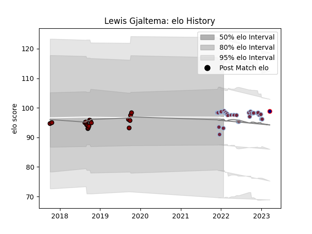

---  
layout: page  
title: Lewis Gjaltema  
date: 2023-01-06 00:23:18.923357  
categories: player  
---
# Lewis Gjaltema

## Positions: SH

## Current elo: 102.0

## Current Percentile: None

# Elo History

# Match History

| Team          |   Appearances |   Win Rate |
|:--------------|--------------:|-----------:|
| Harlequins    |            31 |   0.548387 |
| North Harbour |            17 |   0.470588 |

| Opponent           |   Matches |   Win Rate |
|:-------------------|----------:|-----------:|
| Northampton Saints |         4 |   0.5      |
| Gloucester Rugby   |         3 |   1        |
| Tasman             |         3 |   0        |
| London Irish       |         3 |   0.666667 |
| Leicester Tigers   |         3 |   0.333333 |
| Saracens           |         3 |   0        |
| Canterbury         |         3 |   0        |
| Castres Olympique  |         2 |   1        |
| Exeter Chiefs      |         2 |   0        |
| Sale Sharks        |         2 |   0.5      |
| Bath Rugby         |         2 |   0.5      |
| Newcastle Falcons  |         2 |   1        |
| Wellington         |         2 |   0.5      |
| Waikato            |         1 |   1        |
| Taranaki           |         1 |   1        |
| Wasps              |         1 |   1        |
| Sharks             |         1 |   0        |
| Auckland           |         1 |   0        |
| Manawatu           |         1 |   1        |
| Otago              |         1 |   0        |
| Northland          |         1 |   1        |
| Hawke's Bay        |         1 |   1        |
| Counties Manukau   |         1 |   1        |
| Cardiff Blues      |         1 |   1        |
| Bristol Rugby      |         1 |   0        |
| Bay of Plenty      |         1 |   1        |
| Worcester Warriors |         1 |   1        |