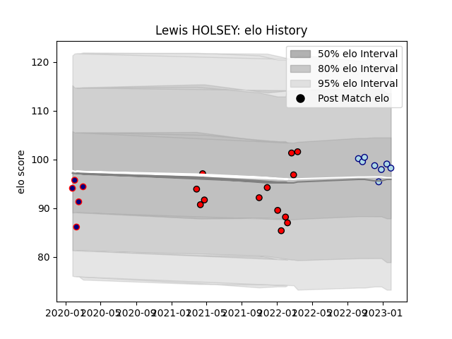

---  
layout: page  
title: Lewis HOLSEY  
date: 2023-03-06 11:28:38.120268  
categories: player  
---
# Lewis HOLSEY

## Positions: P

## Current elo: 100.0

## Current Percentile: 52.0

# Elo History

# Match History

| Team             |   Appearances |   Win Rate |
|:-----------------|--------------:|-----------:|
| Hartpury College |            13 |   0.307692 |
| Bedford          |             9 |   0.555556 |
| London Scottish  |             5 |   0.2      |

| Opponent            |   Matches |   Win Rate |
|:--------------------|----------:|-----------:|
| Ampthill            |         5 |       0.4  |
| Doncaster           |         4 |       0.25 |
| Nottingham          |         4 |       0.75 |
| Ealing Trailfinders |         3 |       0    |
| Bedford             |         2 |       0.5  |
| Coventry            |         2 |       0    |
| Richmond            |         2 |       0    |
| Caldy               |         1 |       0    |
| Hartpury College    |         1 |       1    |
| Jersey              |         1 |       0    |
| London Scottish     |         1 |       1    |
| Yorkshire Carnegie  |         1 |       1    |