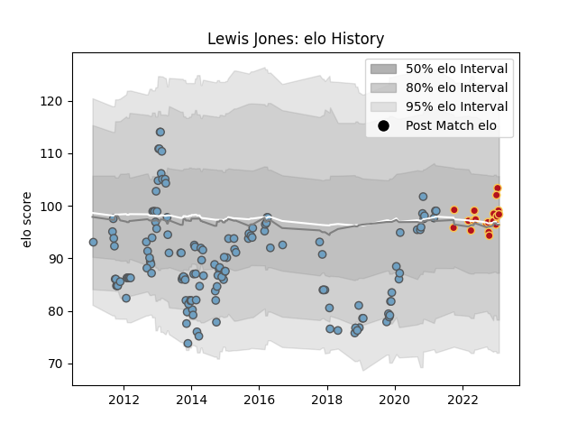

---  
layout: page  
title: Lewis Jones  
date: 2023-02-02 18:46:12.942363  
categories: player  
---
# Lewis Jones

## Positions: SH

## Current elo: 98.0

## Current Percentile: 58.0

# Elo History

# Match History

| Team          |   Appearances |   Win Rate |
|:--------------|--------------:|-----------:|
| Cardiff Blues |           144 |  0.423611  |
| Dragons       |            21 |  0.0714286 |

| Opponent            |   Matches |   Win Rate |
|:--------------------|----------:|-----------:|
| Ospreys             |        14 |   0.142857 |
| Munster             |        13 |   0.153846 |
| Connacht            |        12 |   0.708333 |
| Edinburgh           |        12 |   0.5      |
| Benetton Treviso    |        11 |   0.772727 |
| Glasgow Warriors    |        11 |   0.181818 |
| Zebre               |         9 |   0.666667 |
| Ulster              |         9 |   0.222222 |
| Scarlets            |         8 |   0.375    |
| Dragons             |         8 |   0.5      |
| Leinster            |         7 |   0        |
| Toulon              |         4 |   0.25     |
| Lions               |         4 |   0.125    |
| London Irish        |         4 |   0.5      |
| Saracens            |         3 |   0        |
| Sale Sharks         |         3 |   0.333333 |
| Leicester Tigers    |         2 |   0        |
| Pau                 |         2 |   0.5      |
| Wasps               |         2 |   1        |
| Calvisano           |         2 |   1        |
| Sharks              |         2 |   0        |
| Cardiff Blues       |         2 |   0        |
| Harlequins          |         2 |   1        |
| Rovigo              |         2 |   1        |
| Cheetahs            |         2 |   0.5      |
| Newcastle Falcons   |         2 |   0        |
| Exeter Chiefs       |         2 |   0        |
| Montpellier Herault |         2 |   0        |
| Lyon                |         2 |   1        |
| Aironi              |         2 |   1        |
| Stormers            |         1 |   0        |
| Bath Rugby          |         1 |   0        |
| Bulls               |         1 |   0        |
| Gloucester Rugby    |         1 |   0        |
| Worcester Warriors  |         1 |   0        |