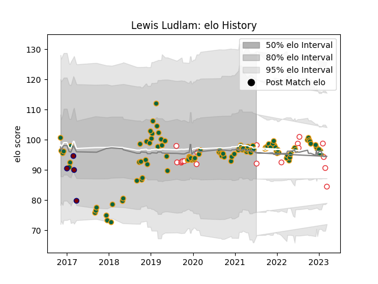

---  
layout: page  
title: Lewis Ludlam  
date: 2023-03-21 18:44:48.043213  
categories: player  
---
# Lewis Ludlam

Last updated: 2023-03-21
## Positions: FL, N8

## Country: England

## Current elo: 92.0

## Current Percentile: 52.0

# Elo History

# Match History

| Team               |   Appearances |   Win Rate |
|:-------------------|--------------:|-----------:|
| Northampton Saints |           109 |   0.440367 |
| England            |            19 |   0.631579 |
| Rotherham Titans   |             4 |   0        |

| Opponent                 |   Matches |   Win Rate |
|:-------------------------|----------:|-----------:|
| Gloucester Rugby         |         9 |   0.444444 |
| Wasps                    |         9 |   0.555556 |
| Leicester Tigers         |         9 |   0.333333 |
| Exeter Chiefs            |         9 |   0.333333 |
| Bath Rugby               |         8 |   0.5      |
| Sale Sharks              |         7 |   0.428571 |
| Newcastle Falcons        |         7 |   0.571429 |
| Harlequins               |         7 |   0.285714 |
| Worcester Warriors       |         6 |   1        |
| Bristol Rugby            |         6 |   0.5      |
| Saracens                 |         5 |   0        |
| Australia                |         4 |   0.75     |
| London Irish             |         4 |   1        |
| Wales                    |         3 |   0.666667 |
| Ulster                   |         3 |   0        |
| Scotland                 |         3 |   0.333333 |
| Clermont Auvergne        |         3 |   0        |
| France                   |         2 |   0        |
| Munster                  |         2 |   0        |
| Benetton Treviso         |         2 |   1        |
| United States of America |         2 |   1        |
| Ospreys                  |         2 |   0        |
| La Rochelle              |         2 |   0        |
| Leinster                 |         2 |   0        |
| Lyon                     |         2 |   1        |
| Montpellier Herault      |         1 |   0        |
| Dragons                  |         1 |   1        |
| Italy                    |         1 |   1        |
| Ealing Trailfinders      |         1 |   0        |
| Tonga                    |         1 |   1        |
| Timisoara Saracens       |         1 |   1        |
| Scarlets                 |         1 |   1        |
| Canada                   |         1 |   1        |
| London Scottish          |         1 |   0        |
| Racing 92                |         1 |   0        |
| Ireland                  |         1 |   0        |
| Nottingham               |         1 |   0        |
| Cornish Pirates          |         1 |   0        |
| Argentina                |         1 |   1        |