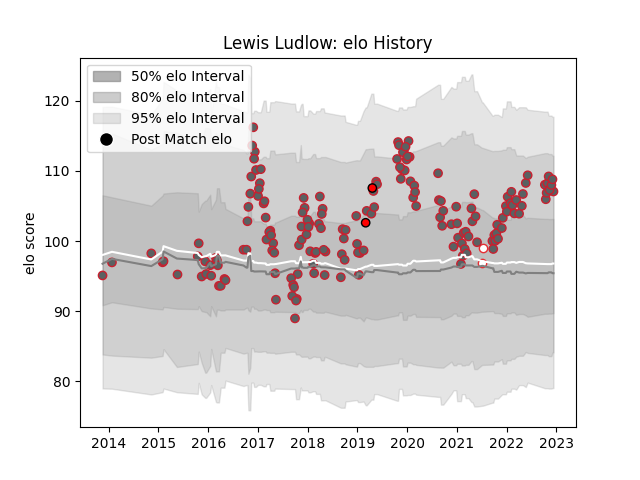

---  
layout: page  
title: Lewis Ludlow  
date: 2022-12-31 16:26:05.831637  
categories: player  
---
# Lewis Ludlow

## Positions: FL

## Country: England

## Current elo: 105.0

## Current Percentile: 83.0

# Elo History

# Match History

| Team             |   Appearances |   Win Rate |
|:-----------------|--------------:|-----------:|
| Gloucester Rugby |           172 |   0.511628 |
| England          |             2 |   1        |
| Hartpury College |             2 |   0.5      |

| Opponent                 |   Matches |   Win Rate |
|:-------------------------|----------:|-----------:|
| Newcastle Falcons        |        14 |   0.714286 |
| Sale Sharks              |        14 |   0.428571 |
| Bath Rugby               |        12 |   0.541667 |
| London Irish             |        12 |   0.708333 |
| Leicester Tigers         |        12 |   0.166667 |
| Harlequins               |        12 |   0.25     |
| Worcester Warriors       |        11 |   0.727273 |
| Wasps                    |        11 |   0.590909 |
| Saracens                 |        11 |   0.454545 |
| Northampton Saints       |        11 |   0.363636 |
| Exeter Chiefs            |        11 |   0.409091 |
| Bristol Rugby            |        10 |   0.5      |
| La Rochelle              |         4 |   0.75     |
| Zebre                    |         3 |   1        |
| Connacht                 |         3 |   0.666667 |
| Montpellier Herault      |         2 |   0.5      |
| Pau                      |         2 |   0        |
| Stade Toulousain         |         2 |   0        |
| Agen                     |         2 |   1        |
| Cardiff Blues            |         2 |   0.5      |
| Benetton Treviso         |         2 |   1        |
| Bayonne                  |         2 |   1        |
| Munster                  |         1 |   0        |
| London Welsh             |         1 |   1        |
| Ealing Trailfinders      |         1 |   0        |
| Ospreys                  |         1 |   1        |
| Castres Olympique        |         1 |   0        |
| Canada                   |         1 |   1        |
| Scarlets                 |         1 |   0        |
| Stade Francais Paris     |         1 |   0        |
| Bordeaux Begles          |         1 |   1        |
| United States of America |         1 |   1        |
| London Scottish          |         1 |   1        |