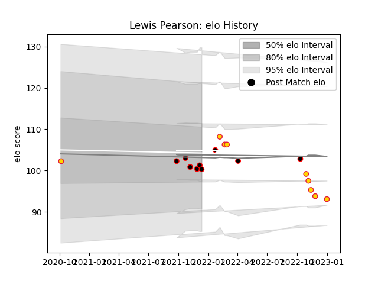

---  
layout: page  
title: Lewis Pearson  
date: 2023-01-06 00:18:48.961734  
categories: player  
---
# Lewis Pearson

## Positions: FL, L

## Current elo: 100.0

## Current Percentile: None

# Elo History

# Match History

| Team            |   Appearances |   Win Rate |
|:----------------|--------------:|-----------:|
| Cornish Pirates |             9 |   0.722222 |
| Exeter Chiefs   |             9 |   0.333333 |

| Opponent           |   Matches |   Win Rate |
|:-------------------|----------:|-----------:|
| Ampthill           |         3 |   0.833333 |
| Newcastle Falcons  |         2 |   0.5      |
| Northampton Saints |         2 |   0.5      |
| Nottingham         |         2 |   1        |
| Wasps              |         2 |   0        |
| Doncaster          |         1 |   1        |
| Gloucester Rugby   |         1 |   0        |
| Hartpury College   |         1 |   0        |
| Jersey             |         1 |   0        |
| London Irish       |         1 |   1        |
| London Scottish    |         1 |   1        |
| Saracens           |         1 |   0        |