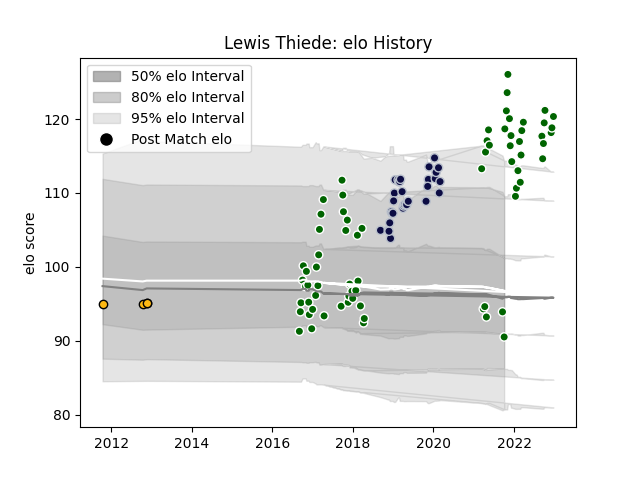

---  
layout: page  
title: Lewis Thiede  
date: 2023-03-21 18:12:07.900056  
categories: player  
---
# Lewis Thiede

Last updated: 2023-03-21
## Positions: P

## Current elo: 85.0

## Current Percentile: 97.0

# Elo History

# Match History

| Team                |   Appearances |   Win Rate |
|:--------------------|--------------:|-----------:|
| Ealing Trailfinders |            73 |   0.787671 |
| Bristol Rugby       |            33 |   0.606061 |
| Doncaster           |             5 |   0.4      |
| Wasps               |             4 |   0.75     |

| Opponent               |   Matches |   Win Rate |
|:-----------------------|----------:|-----------:|
| Bedford                |         9 |   0.888889 |
| Cornish Pirates        |         8 |   0.4375   |
| Doncaster              |         8 |   0.625    |
| Jersey                 |         7 |   1        |
| Richmond               |         6 |   1        |
| Nottingham             |         6 |   0.666667 |
| London Scottish        |         6 |   0.833333 |
| Hartpury College       |         6 |   1        |
| Yorkshire Carnegie     |         5 |   0.4      |
| Rotherham Titans       |         5 |   1        |
| Ampthill               |         4 |   1        |
| Worcester Warriors     |         4 |   0.5      |
| Saracens               |         3 |   0.333333 |
| La Rochelle            |         3 |   0.333333 |
| Leicester Tigers       |         3 |   1        |
| Coventry               |         3 |   1        |
| Exeter Chiefs          |         3 |   0.333333 |
| Harlequins             |         2 |   0        |
| Bath Rugby             |         2 |   0.5      |
| Bristol Rugby          |         2 |   0        |
| Brive                  |         2 |   1        |
| Wasps                  |         2 |   0        |
| Sale Sharks            |         2 |   0.25     |
| RC Enisei              |         2 |   1        |
| Northampton Saints     |         2 |   1        |
| Newcastle Falcons      |         2 |   1        |
| Gloucester Rugby       |         2 |   1        |
| Zebre                  |         2 |   0.75     |
| Enisey-STM Krasnoyarsk |         1 |   1        |
| Dragons                |         1 |   1        |
| London Welsh           |         1 |   1        |
| London Irish           |         1 |   0        |