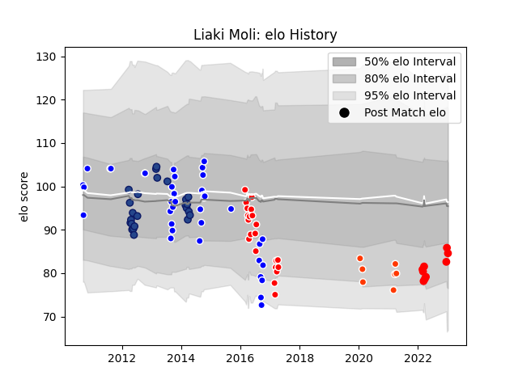

---  
layout: page  
title: Liaki Moli  
date: 2023-03-17 17:08:49.642876  
categories: player  
---
# Liaki Moli

## Positions: L, FL

## Current elo: 83.0

## Current Percentile: 19.0

# Elo History

# Match History

| Team                  |   Appearances |   Win Rate |
|:----------------------|--------------:|-----------:|
| Auckland              |            48 |   0.625    |
| Blues                 |            24 |   0.333333 |
| Sunwolves             |            21 |   0.119048 |
| Hino Red Dolphins     |            16 |   0.3125   |
| Yokohama Canon Eagles |             6 |   0.666667 |

| Opponent                          |   Matches |   Win Rate |
|:----------------------------------|----------:|-----------:|
| Canterbury                        |         7 |   0.142857 |
| Taranaki                          |         6 |   0.666667 |
| Bulls                             |         6 |   0.166667 |
| Bay of Plenty                     |         5 |   0.8      |
| Wellington                        |         5 |   0.8      |
| Hurricanes                        |         5 |   0.2      |
| Cheetahs                          |         4 |   0.25     |
| Counties Manukau                  |         4 |   0.5      |
| Crusaders                         |         4 |   0.5      |
| North Harbour                     |         4 |   1        |
| Highlanders                       |         4 |   0.25     |
| Waikato                           |         4 |   0.25     |
| Lions                             |         3 |   0.333333 |
| Northland                         |         3 |   1        |
| Stormers                          |         3 |   0.166667 |
| Brumbies                          |         3 |   0.333333 |
| Manawatu                          |         3 |   1        |
| Otago                             |         3 |   0.666667 |
| Tokyo Sungoliath                  |         3 |   0        |
| Green Rockets Tokatsu             |         3 |   0.666667 |
| Toshiba Brave Lupus Tokyo         |         2 |   0        |
| Queensland Reds                   |         2 |   0        |
| Southern Kings                    |         2 |   0        |
| Sharks                            |         2 |   0        |
| Toyota Verblitz                   |         2 |   0.5      |
| Tasman                            |         2 |   0        |
| Munakata Sanix Blues              |         2 |   0.5      |
| NTT Docomo Red Hurricanes Osaka   |         2 |   0.5      |
| Black Rams Tokyo                  |         2 |   0.5      |
| Kubota Spears Funabashi Tokyo-Bay |         2 |   0.5      |
| Hawke's Bay                       |         2 |   1        |
| Chiefs                            |         2 |   0        |
| Western Force                     |         2 |   0.5      |
| New South Wales Waratahs          |         1 |   0        |
| Shimizu Blue Sharks               |         1 |   1        |
| Melbourne Rebels                  |         1 |   0        |
| Kobelco Kobe Steelers             |         1 |   0        |
| Jaguares                          |         1 |   1        |
| Toyota Industries Shuttles Aichi  |         1 |   0        |
| Coca-Cola Red Sparks              |         1 |   1        |