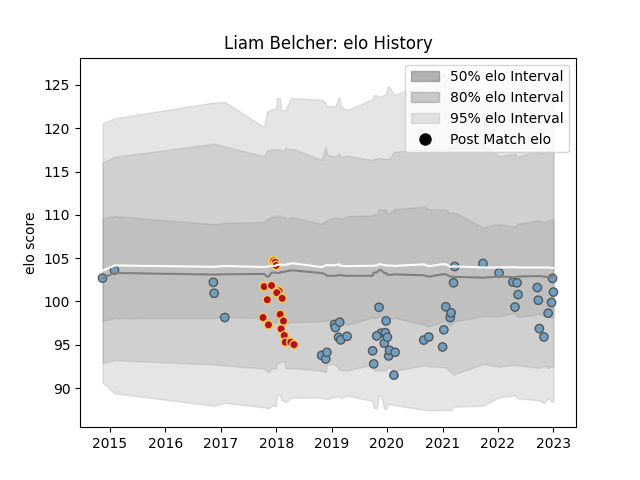

---  
layout: page  
title: Liam Belcher  
date: 2023-01-06 00:20:00.670891  
categories: player  
---
# Liam Belcher

## Positions: H

## Current elo: 101.0

## Current Percentile: 49.0

# Elo History

# Match History

| Team          |   Appearances |   Win Rate |
|:--------------|--------------:|-----------:|
| Cardiff Blues |            50 |        0.5 |
| Dragons       |            20 |        0.2 |

| Opponent           |   Matches |   Win Rate |
|:-------------------|----------:|-----------:|
| Scarlets           |         7 |   0.428571 |
| Ospreys            |         7 |   0.285714 |
| Edinburgh          |         6 |   0.333333 |
| Connacht           |         5 |   0.4      |
| Benetton Treviso   |         4 |   0.5      |
| Glasgow Warriors   |         4 |   0.125    |
| Ulster             |         3 |   0.166667 |
| Southern Kings     |         3 |   0.666667 |
| Munster            |         3 |   0.333333 |
| Newcastle Falcons  |         3 |   0.333333 |
| Dragons            |         3 |   1        |
| Leicester Tigers   |         2 |   0        |
| Cardiff Blues      |         2 |   0        |
| Cheetahs           |         2 |   0.5      |
| Zebre              |         2 |   1        |
| Bordeaux Begles    |         2 |   0.5      |
| Northampton Saints |         1 |   0        |
| Pau                |         1 |   0        |
| RC Enisei          |         1 |   1        |
| Lions              |         1 |   0        |
| Saracens           |         1 |   0        |
| Exeter Chiefs      |         1 |   0        |
| Sharks             |         1 |   1        |
| Lyon               |         1 |   1        |
| Calvisano          |         1 |   1        |
| Wasps              |         1 |   1        |
| Worcester Warriors |         1 |   1        |
| Sale Sharks        |         1 |   0        |