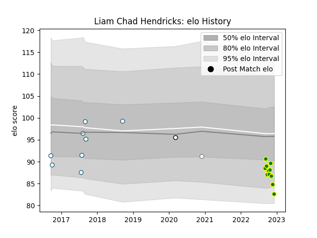

---  
layout: page  
title: Liam Chad Hendricks  
date: 2022-11-15 23:44:19.997134  
categories: player  
---
# Liam Chad Hendricks

## Positions: P

## Current elo: 87.0

## Current Percentile: 25.0

# Elo History

# Match History

| Team                |   Appearances |   Win Rate |
|:--------------------|--------------:|-----------:|
| Carqueiranne-Hyères |             9 |   0.444444 |
| Griquas             |             8 |   0.25     |
| Olimpia Lions       |             1 |   0        |
| Pumas               |             1 |   0        |

| Opponent                   |   Matches |   Win Rate |
|:---------------------------|----------:|-----------:|
| Blue Bulls                 |         3 |        0   |
| Free State Cheetahs        |         2 |        0.5 |
| Golden Lions               |         2 |        0   |
| Albi                       |         1 |        1   |
| Blagnac                    |         1 |        0   |
| Bourgoin-Jallieu           |         1 |        0   |
| Ceibos Rugby               |         1 |        0   |
| Chambery                   |         1 |        1   |
| Cognac Saint Jean d'Angély |         1 |        1   |
| Natal Sharks               |         1 |        0   |
| Suresnes                   |         1 |        0   |
| Tarbes                     |         1 |        1   |
| US Bressane                |         1 |        0   |
| Valence Romans Drome Rugby |         1 |        0   |
| Western Province           |         1 |        1   |