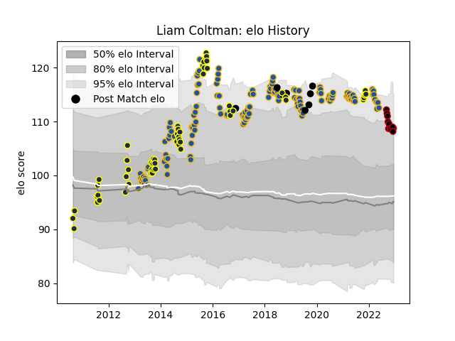

---  
layout: page  
title: Liam Coltman  
date: 2022-12-14 11:36:37.506324  
categories: player  
---
# Liam Coltman

## Positions: H

## Country: New Zealand

## Current elo: 109.0

## Current Percentile: 89.0

# Elo History

# Match History

| Team        |   Appearances |   Win Rate |
|:------------|--------------:|-----------:|
| Highlanders |           137 |   0.510949 |
| Otago       |            57 |   0.54386  |
| Lyon        |            11 |   0.545455 |
| New Zealand |             8 |   0.875    |

| Opponent                 |   Matches |   Win Rate |
|:-------------------------|----------:|-----------:|
| Blues                    |        20 |   0.5      |
| Crusaders                |        18 |   0.166667 |
| Hurricanes               |        18 |   0.388889 |
| Chiefs                   |        16 |   0.53125  |
| Queensland Reds          |         8 |   0.625    |
| New South Wales Waratahs |         8 |   0.625    |
| Brumbies                 |         8 |   0.625    |
| Northland                |         7 |   0.714286 |
| Melbourne Rebels         |         7 |   0.714286 |
| Hawke's Bay              |         7 |   0.285714 |
| Southland                |         6 |   0.666667 |
| Sharks                   |         6 |   0.5      |
| Western Force            |         6 |   0.666667 |
| Tasman                   |         6 |   0.5      |
| Bulls                    |         6 |   0.416667 |
| North Harbour            |         5 |   0.8      |
| Canterbury               |         5 |   0.2      |
| Stormers                 |         5 |   0.6      |
| Lions                    |         5 |   0.6      |
| Manawatu                 |         5 |   0.8      |
| Bay of Plenty            |         4 |   0.75     |
| Waikato                  |         4 |   0.5      |
| Cheetahs                 |         2 |   1        |
| Sunwolves                |         2 |   1        |
| Counties Manukau         |         2 |   0.5      |
| Taranaki                 |         2 |   0.5      |
| Auckland                 |         2 |   0.5      |
| Wellington               |         2 |   0        |
| Southern Kings           |         1 |   0        |
| Tonga                    |         1 |   1        |
| Wales                    |         1 |   1        |
| Stade Francais Paris     |         1 |   1        |
| Stade Toulousain         |         1 |   1        |
| South Africa             |         1 |   0        |
| Argentina                |         1 |   1        |
| Racing 92                |         1 |   0        |
| Pau                      |         1 |   1        |
| Japan                    |         1 |   1        |
| Jaguares                 |         1 |   1        |
| Italy                    |         1 |   1        |
| France                   |         1 |   1        |
| Clermont Auvergne        |         1 |   0        |
| Castres Olympique        |         1 |   1        |
| Canada                   |         1 |   1        |
| Brive                    |         1 |   1        |
| British and Irish Lions  |         1 |   1        |
| Bordeaux Begles          |         1 |   1        |
| Bayonne                  |         1 |   0        |
| La Rochelle              |         1 |   0        |