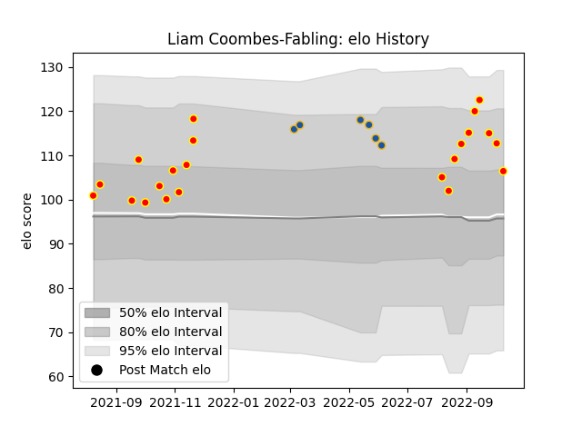

---  
layout: page  
title: Liam Coombes-Fabling  
date: 2023-02-24 09:57:06.057884  
categories: player  
---
# Liam Coombes-Fabling

## Positions: W, FB

## Current elo: 106.0

## Current Percentile: 84.0

# Elo History

# Match History

| Team        |   Appearances |   Win Rate |
|:------------|--------------:|-----------:|
| Waikato     |            22 |   0.704545 |
| Highlanders |             6 |   0.166667 |

| Opponent                 |   Matches |   Win Rate |
|:-------------------------|----------:|-----------:|
| Tasman                   |         3 |   1        |
| Bay of Plenty            |         3 |   0.666667 |
| Northland                |         2 |   0.5      |
| Blues                    |         2 |   0        |
| Canterbury               |         2 |   0.5      |
| Wellington               |         2 |   0.5      |
| Hawke's Bay              |         2 |   0.25     |
| Taranaki                 |         2 |   0.5      |
| Auckland                 |         1 |   1        |
| Southland                |         1 |   1        |
| Otago                    |         1 |   1        |
| New South Wales Waratahs |         1 |   0        |
| North Harbour            |         1 |   1        |
| Melbourne Rebels         |         1 |   0        |
| Manawatu                 |         1 |   1        |
| Hurricanes               |         1 |   0        |
| Counties Manukau         |         1 |   1        |
| Western Force            |         1 |   1        |