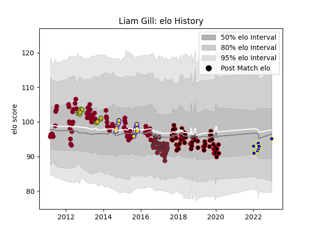

---  
layout: page  
title: Liam Gill  
date: 2022-12-28 12:53:02.299754  
categories: player  
---
# Liam Gill

## Positions: FL

## Country: Australia

## Current elo: 95.0

## Current Percentile: 39.0

# Elo History

# Match History

| Team            |   Appearances |   Win Rate |
|:----------------|--------------:|-----------:|
| Queensland Reds |            77 |   0.519481 |
| Lyon            |            60 |   0.566667 |
| Toulon          |            29 |   0.551724 |
| Australia       |            15 |   0.5      |
| Brisbane City   |            13 |   0.923077 |
| Urayasu D-Rocks |             7 |   0.571429 |

| Opponent                          |   Matches |   Win Rate |
|:----------------------------------|----------:|-----------:|
| New South Wales Waratahs          |        10 |   0.5      |
| Brumbies                          |         9 |   0.5      |
| Clermont Auvergne                 |         9 |   0.222222 |
| Melbourne Rebels                  |         9 |   0.777778 |
| Montpellier Herault               |         8 |   0.5      |
| Western Force                     |         7 |   0.642857 |
| Stade Toulousain                  |         6 |   0.75     |
| Castres Olympique                 |         6 |   0.5      |
| Bordeaux Begles                   |         6 |   0.833333 |
| La Rochelle                       |         6 |   0.416667 |
| Brive                             |         5 |   0.6      |
| Toulon                            |         5 |   0.7      |
| Sharks                            |         5 |   0.2      |
| Chiefs                            |         5 |   0.6      |
| Racing 92                         |         5 |   0.6      |
| Crusaders                         |         5 |   0.2      |
| Pau                               |         5 |   0.8      |
| Highlanders                       |         4 |   0.75     |
| Stormers                          |         4 |   0.25     |
| Hurricanes                        |         4 |   0.25     |
| Stade Francais Paris              |         4 |   0.75     |
| Cheetahs                          |         4 |   0.75     |
| Bulls                             |         4 |   0.25     |
| New Zealand                       |         4 |   0.125    |
| Blues                             |         4 |   0.75     |
| NSW Country Eagles                |         3 |   1        |
| Saracens                          |         3 |   0        |
| Agen                              |         3 |   1        |
| Grenoble                          |         3 |   0.833333 |
| South Africa                      |         3 |   0.333333 |
| Queensland Country                |         2 |   1        |
| Northampton Saints                |         2 |   0        |
| Argentina                         |         2 |   1        |
| Lions                             |         2 |   0.5      |
| Lyon                              |         2 |   0.5      |
| Perth Spirit                      |         2 |   1        |
| Sale Sharks                       |         2 |   1        |
| Bayonne                           |         2 |   1        |
| Canberra Vikings                  |         2 |   1        |
| British and Irish Lions           |         2 |   0.5      |
| Benetton Treviso                  |         2 |   0.5      |
| Shimizu Blue Sharks               |         1 |   1        |
| Saitama Wild Knights              |         1 |   0        |
| Sydney Stars                      |         1 |   1        |
| Sunwolves                         |         1 |   1        |
| Leinster                          |         1 |   0        |
| Perpignan                         |         1 |   1        |
| Oyonnax                           |         1 |   0        |
| North Harbour Rays                |         1 |   1        |
| Melbourne Rising                  |         1 |   0        |
| Kubota Spears Funabashi Tokyo-Bay |         1 |   0        |
| Kobelco Kobe Steelers             |         1 |   1        |
| Italy                             |         1 |   1        |
| Ireland                           |         1 |   1        |
| Green Rockets Tokatsu             |         1 |   1        |
| Greater Sydney Rams               |         1 |   1        |
| Glasgow Warriors                  |         1 |   0        |
| France                            |         1 |   0        |
| England                           |         1 |   1        |
| Cardiff Blues                     |         1 |   0        |
| Black Rams Tokyo                  |         1 |   1        |
| Yokohama Canon Eagles             |         1 |   0        |