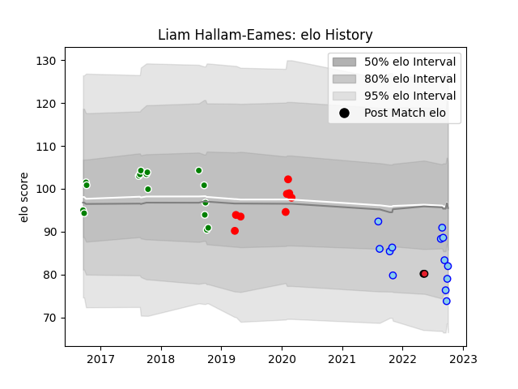

---  
layout: page  
title: Liam Hallam-Eames  
date: 2023-03-17 17:25:05.151263  
categories: player  
---
# Liam Hallam-Eames

## Positions: L

## Current elo: 82.0

## Current Percentile: 12.0

# Elo History

# Match History

| Team      |   Appearances |   Win Rate |
|:----------|--------------:|-----------:|
| Manawatu  |            16 |   0.375    |
| Northland |            13 |   0.384615 |
| Jersey    |             8 |   0.25     |
| Crusaders |             2 |   1        |

| Opponent            |   Matches |   Win Rate |
|:--------------------|----------:|-----------:|
| Wellington          |         5 |   0.4      |
| Bay of Plenty       |         4 |   0.5      |
| Tasman              |         3 |   0.333333 |
| Taranaki            |         3 |   0        |
| Southland           |         3 |   0.666667 |
| Canterbury          |         2 |   0.5      |
| Hawke's Bay         |         2 |   0        |
| Otago               |         2 |   0        |
| Auckland            |         1 |   1        |
| North Harbour       |         1 |   0        |
| Western Force       |         1 |   1        |
| Waikato             |         1 |   1        |
| Richmond            |         1 |   1        |
| Manawatu            |         1 |   1        |
| Newcastle Falcons   |         1 |   0        |
| Hartpury College    |         1 |   0        |
| Ealing Trailfinders |         1 |   0        |
| Doncaster           |         1 |   0        |
| Coventry            |         1 |   0        |
| Counties Manukau    |         1 |   0        |
| Brumbies            |         1 |   1        |
| Bedford             |         1 |   0        |
| Yorkshire Carnegie  |         1 |   1        |