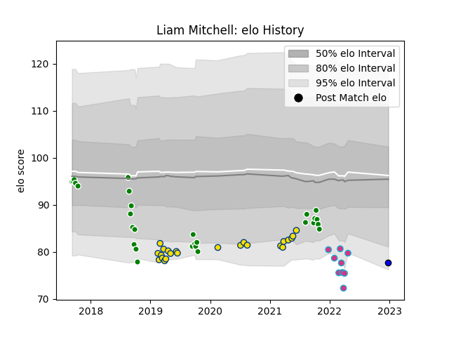

---  
layout: page  
title: Liam Mitchell  
date: 2022-12-28 12:52:49.436384  
categories: player  
---
# Liam Mitchell

## Positions: L, FL

## Current elo: 78.0

## Current Percentile: 6.0

# Elo History

# Match History

| Team                 |   Appearances |   Win Rate |
|:---------------------|--------------:|-----------:|
| Manawatu             |            28 |   0.464286 |
| Hurricanes           |            23 |   0.717391 |
| Zebre                |             9 |   0        |
| Saitama Wild Knights |             1 |   1        |

| Opponent                 |   Matches |   Win Rate |
|:-------------------------|----------:|-----------:|
| Bay of Plenty            |         4 |   0.25     |
| Chiefs                   |         4 |   0.375    |
| Southland                |         4 |   1        |
| Crusaders                |         4 |   0.25     |
| Highlanders              |         4 |   0.75     |
| Canterbury               |         3 |   0.333333 |
| Hawke's Bay              |         3 |   0        |
| Northland                |         3 |   0.666667 |
| New South Wales Waratahs |         2 |   1        |
| Waikato                  |         2 |   1        |
| Taranaki                 |         2 |   0        |
| Stormers                 |         2 |   0.5      |
| Sharks                   |         2 |   0.5      |
| Otago                    |         2 |   0.5      |
| Wellington               |         2 |   0        |
| Melbourne Rebels         |         2 |   1        |
| Counties Manukau         |         2 |   1        |
| Benetton Treviso         |         1 |   0        |
| North Harbour            |         1 |   0        |
| Lions                    |         1 |   1        |
| Ospreys                  |         1 |   0        |
| Glasgow Warriors         |         1 |   0        |
| Queensland Reds          |         1 |   1        |
| Scarlets                 |         1 |   0        |
| Edinburgh                |         1 |   0        |
| Shizuoka Blue Revs       |         1 |   1        |
| Bulls                    |         1 |   0        |
| Sunwolves                |         1 |   1        |
| Brumbies                 |         1 |   1        |
| Blues                    |         1 |   1        |
| Munster                  |         1 |   0        |