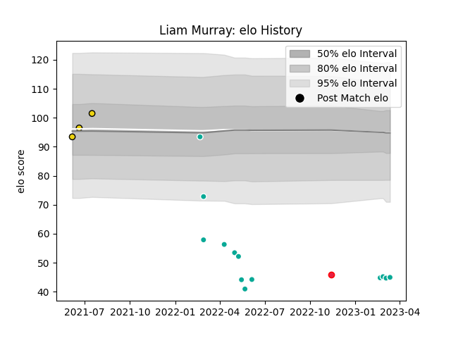

---  
layout: page  
title: Liam Murray  
date: 2023-03-17 17:16:13.174636  
categories: player  
---
# Liam Murray

## Positions: P

## Country: Canada

## Current elo: 45.0

## Current Percentile: 0.0

# Elo History

# Match History

| Team              |   Appearances |   Win Rate |
|:------------------|--------------:|-----------:|
| Dallas Jackals    |            13 |          0 |
| Houston SaberCats |             3 |          0 |
| Canada            |             1 |          1 |

| Opponent          |   Matches |   Win Rate |
|:------------------|----------:|-----------:|
| Houston SaberCats |         3 |          0 |
| Seattle Seawolves |         3 |          0 |
| San Diego Legion  |         2 |          0 |
| Utah Warriors     |         2 |          0 |
| Austin Gilgronis  |         1 |          0 |
| L. A. Giltinis    |         1 |          0 |
| Netherlands       |         1 |          1 |
| R.U. New York     |         1 |          0 |
| Rugby ATL         |         1 |          0 |
| Rugby New York    |         1 |          0 |
| Toronto Arrows    |         1 |          0 |