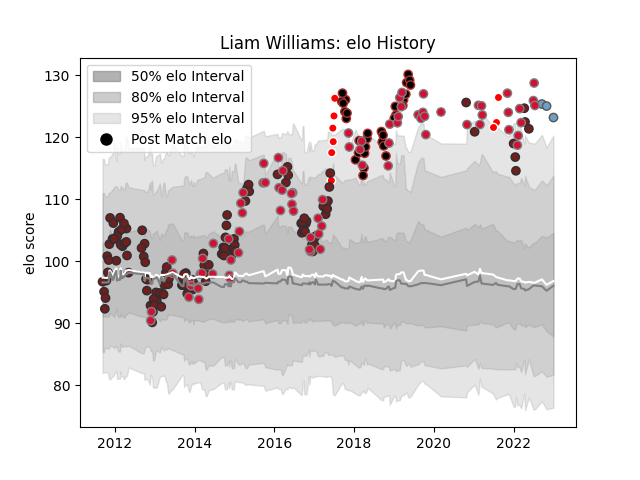

---  
layout: page  
title: Liam Williams  
date: 2023-01-03 11:27:49.292517  
categories: player  
---
# Liam Williams

## Positions: FB, W

## Country: Wales

## Current elo: 123.0

## Current Percentile: 97.0

# Elo History

# Match History

| Team                    |   Appearances |   Win Rate |
|:------------------------|--------------:|-----------:|
| Scarlets                |           114 |   0.530702 |
| Wales                   |            78 |   0.557692 |
| Saracens                |            31 |   0.887097 |
| British and Irish Lions |             9 |   0.611111 |
| Cardiff Blues           |             3 |   0.333333 |

| Opponent           |   Matches |   Win Rate |
|:-------------------|----------:|-----------:|
| Ospreys            |        13 |   0.461538 |
| South Africa       |        12 |   0.416667 |
| Cardiff Blues      |        11 |   0.818182 |
| Munster            |        11 |   0.409091 |
| England            |        11 |   0.272727 |
| Benetton Treviso   |        10 |   0.7      |
| Leinster           |         9 |   0.333333 |
| Edinburgh          |         9 |   0.611111 |
| Dragons            |         9 |   0.777778 |
| France             |         9 |   0.666667 |
| Ireland            |         8 |   0.4375   |
| New Zealand        |         8 |   0.1875   |
| Scotland           |         8 |   0.75     |
| Glasgow Warriors   |         8 |   0.5      |
| Australia          |         8 |   0.375    |
| Ulster             |         7 |   0.5      |
| Italy              |         7 |   1        |
| Northampton Saints |         6 |   0.666667 |
| Connacht           |         6 |   0.666667 |
| Sale Sharks        |         5 |   0.6      |
| Japan              |         4 |   0.75     |
| Zebre              |         4 |   0.875    |
| Clermont Auvergne  |         4 |   0        |
| Toulon             |         3 |   0.333333 |
| Harlequins         |         3 |   1        |
| Fiji               |         3 |   1        |
| Bath Rugby         |         3 |   0.666667 |
| Gloucester Rugby   |         3 |   1        |
| Exeter Chiefs      |         3 |   0.333333 |
| Argentina          |         2 |   1        |
| Newcastle Falcons  |         2 |   1        |
| Bristol Rugby      |         2 |   0.5      |
| Saracens           |         2 |   0.25     |
| Castres Olympique  |         2 |   1        |
| Wasps              |         2 |   1        |
| Lyon               |         2 |   1        |
| London Irish       |         2 |   1        |
| Leicester Tigers   |         2 |   1        |
| Georgia            |         2 |   1        |
| Uruguay            |         1 |   1        |
| Tonga              |         1 |   1        |
| Blues              |         1 |   0        |
| Racing 92          |         1 |   0.5      |
| Stormers           |         1 |   0        |
| Bordeaux Begles    |         1 |   0        |
| Brive              |         1 |   0        |
| Chiefs             |         1 |   1        |
| Crusaders          |         1 |   1        |
| Aironi             |         1 |   1        |