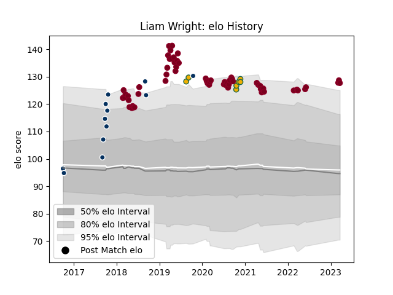

---  
layout: page  
title: Liam Wright  
date: 2023-03-21 18:35:19.554633  
categories: player  
---
# Liam Wright

Last updated: 2023-03-21
## Positions: FL

## Country: Australia

## Current elo: 128.0

## Current Percentile: 95.0

# Elo History

# Match History

| Team               |   Appearances |   Win Rate |
|:-------------------|--------------:|-----------:|
| Queensland Reds    |            62 |   0.427419 |
| Queensland Country |            12 |   0.75     |
| Australia          |             7 |   0.428571 |

| Opponent                 |   Matches |   Win Rate |
|:-------------------------|----------:|-----------:|
| Brumbies                 |        12 |   0.416667 |
| Melbourne Rebels         |         8 |   0.5625   |
| New South Wales Waratahs |         7 |   0.285714 |
| Sunwolves                |         5 |   0.8      |
| Crusaders                |         5 |   0        |
| Western Force            |         4 |   0.75     |
| New Zealand              |         4 |   0.25     |
| Highlanders              |         3 |   0        |
| Jaguares                 |         3 |   0.333333 |
| Fijian Drua              |         3 |   0.666667 |
| Chiefs                   |         3 |   0.333333 |
| Bulls                    |         3 |   0.666667 |
| Hurricanes               |         2 |   0        |
| Blues                    |         2 |   0.5      |
| Melbourne Rising         |         2 |   1        |
| NSW Country Eagles       |         2 |   1        |
| Canberra Vikings         |         2 |   0.5      |
| Sharks                   |         2 |   0.5      |
| Brisbane City            |         2 |   0.5      |
| Argentina                |         2 |   0.5      |
| Greater Sydney Rams      |         1 |   1        |
| Lions                    |         1 |   0        |
| Samoa                    |         1 |   1        |
| Stormers                 |         1 |   1        |
| Sydney Rays              |         1 |   1        |