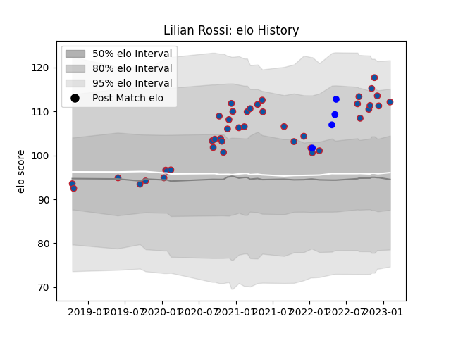

---  
layout: page  
title: Lilian Rossi  
date: 2023-02-04 18:31:17.744997  
categories: player  
---
# Lilian Rossi

## Positions: H

## Current elo: 112.0

## Current Percentile: 86.0

# Elo History

# Match History

| Team     |   Appearances |   Win Rate |
|:---------|--------------:|-----------:|
| Grenoble |            43 |   0.593023 |
| Vannes   |             4 |   0.75     |

| Opponent                   |   Matches |   Win Rate |
|:---------------------------|----------:|-----------:|
| Aurillac                   |         5 |   0.8      |
| Soyaux-Angouleme           |         4 |   1        |
| Montauban                  |         4 |   0.5      |
| Vannes                     |         3 |   0.333333 |
| Mont-de-Marsan             |         3 |   0.666667 |
| Beziers                    |         3 |   0.666667 |
| Biarritz Olympique         |         3 |   0.166667 |
| Oyonnax                    |         3 |   0        |
| Nevers                     |         3 |   1        |
| Valence Romans Drome Rugby |         2 |   1        |
| Perpignan                  |         2 |   0.5      |
| Agen                       |         2 |   1        |
| Carcassonne                |         2 |   0.5      |
| Harlequins                 |         1 |   1        |
| Narbonne                   |         1 |   1        |
| Grenoble                   |         1 |   1        |
| Colomiers                  |         1 |   0        |
| Rouen                      |         1 |   1        |
| Benetton Treviso           |         1 |   0        |
| Bayonne                    |         1 |   0        |
| Lyon                       |         1 |   0        |