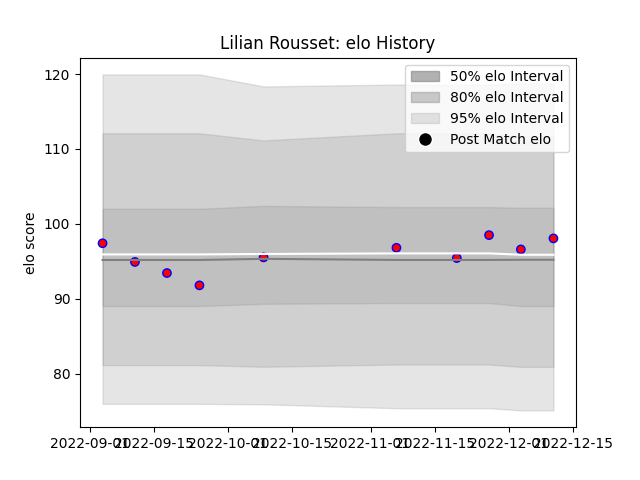

---  
layout: page  
title: Lilian Rousset  
date: 2022-12-14 11:29:56.008339  
categories: player  
---
# Lilian Rousset

## Positions: L

## Current elo: 98.0

## Current Percentile: 55.0

# Elo History

# Match History

| Team    |   Appearances |   Win Rate |
|:--------|--------------:|-----------:|
| Blagnac |            10 |       0.65 |

| Opponent                   |   Matches |   Win Rate |
|:---------------------------|----------:|-----------:|
| Albi                       |         1 |        1   |
| Bourgoin-Jallieu           |         1 |        1   |
| Carqueiranne-Hyères        |         1 |        1   |
| Chambery                   |         1 |        1   |
| Narbonne                   |         1 |        0.5 |
| Nice                       |         1 |        0   |
| Suresnes                   |         1 |        1   |
| Tarbes                     |         1 |        1   |
| US Bressane                |         1 |        0   |
| Valence Romans Drome Rugby |         1 |        0   |