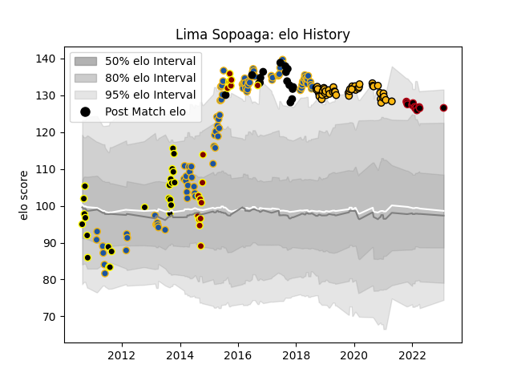

---  
layout: page  
title: Lima Sopoaga  
date: 2023-02-02 18:47:56.011266  
categories: player  
---
# Lima Sopoaga

## Positions: FH

## Country: New Zealand

## Current elo: 127.0

## Current Percentile: 93.0

# Elo History

# Match History

| Team        |   Appearances |   Win Rate |
|:------------|--------------:|-----------:|
| Highlanders |            91 |   0.571429 |
| Wasps       |            48 |   0.46875  |
| Wellington  |            24 |   0.666667 |
| New Zealand |            17 |   0.941176 |
| Southland   |            17 |   0.382353 |
| Lyon        |            13 |   0.538462 |

| Opponent                 |   Matches |   Win Rate |
|:-------------------------|----------:|-----------:|
| Chiefs                   |        15 |   0.533333 |
| Crusaders                |        12 |   0.333333 |
| Hurricanes               |        11 |   0.545455 |
| Blues                    |         9 |   0.666667 |
| New South Wales Waratahs |         8 |   0.625    |
| Bath Rugby               |         7 |   0.5      |
| Canterbury               |         6 |   0.333333 |
| Exeter Chiefs            |         6 |   0.333333 |
| Lions                    |         5 |   0.4      |
| Queensland Reds          |         5 |   0.4      |
| Hawke's Bay              |         5 |   0.3      |
| South Africa             |         5 |   1        |
| Western Force            |         5 |   0.6      |
| Manawatu                 |         4 |   0.5      |
| Stade Toulousain         |         4 |   0.25     |
| Sharks                   |         4 |   0.5      |
| Auckland                 |         4 |   0.25     |
| Sale Sharks              |         4 |   0.5      |
| Brumbies                 |         4 |   0.75     |
| Taranaki                 |         3 |   0.666667 |
| Australia                |         3 |   0.666667 |
| North Harbour            |         3 |   1        |
| Northampton Saints       |         3 |   0.666667 |
| Northland                |         3 |   1        |
| Otago                    |         3 |   0.333333 |
| Harlequins               |         3 |   0.333333 |
| Bay of Plenty            |         3 |   0.666667 |
| Gloucester Rugby         |         3 |   0.333333 |
| Saracens                 |         3 |   0.333333 |
| Bristol Rugby            |         3 |   1        |
| Waikato                  |         3 |   0.666667 |
| Stormers                 |         3 |   0.666667 |
| Melbourne Rebels         |         3 |   1        |
| Wales                    |         2 |   1        |
| Stade Francais Paris     |         2 |   0.5      |
| Newcastle Falcons        |         2 |   0.5      |
| Agen                     |         2 |   1        |
| Edinburgh                |         2 |   0        |
| France                   |         2 |   1        |
| Bulls                    |         2 |   1        |
| Cheetahs                 |         2 |   0.5      |
| Counties Manukau         |         2 |   1        |
| London Irish             |         2 |   0.5      |
| Worcester Warriors       |         2 |   1        |
| Argentina                |         2 |   1        |
| Leinster                 |         2 |   0        |
| Perpignan                |         1 |   1        |
| Clermont Auvergne        |         1 |   1        |
| Biarritz Olympique       |         1 |   1        |
| Bordeaux Begles          |         1 |   0        |
| British and Irish Lions  |         1 |   1        |
| Toulon                   |         1 |   0        |
| Tasman                   |         1 |   0        |
| Castres Olympique        |         1 |   0        |
| Southland                |         1 |   1        |
| Jaguares                 |         1 |   1        |
| Southern Kings           |         1 |   1        |
| Leicester Tigers         |         1 |   1        |
| La Rochelle              |         1 |   0        |
| Scotland                 |         1 |   1        |
| Pau                      |         1 |   1        |
| Samoa                    |         1 |   1        |
| Italy                    |         1 |   1        |
| Racing 92                |         1 |   1        |
| Montpellier Herault      |         1 |   0        |