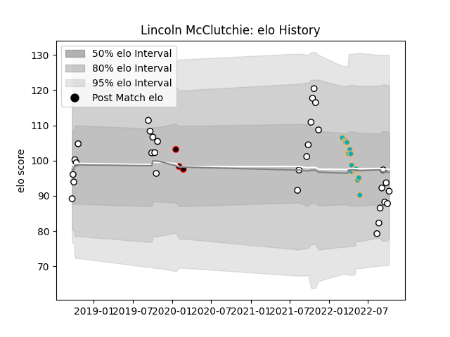

---  
layout: page  
title: Lincoln McClutchie  
date: 2023-03-17 17:27:59.689764  
categories: player  
---
# Lincoln McClutchie

## Positions: FH

## Current elo: 91.0

## Current Percentile: 25.0

# Elo History

# Match History

| Team                            |   Appearances |   Win Rate |
|:--------------------------------|--------------:|-----------:|
| Hawke's Bay                     |            31 |  0.580645  |
| Moana Pasifika                  |            15 |  0.0666667 |
| NTT Docomo Red Hurricanes Osaka |             3 |  0         |

| Opponent                  |   Matches |   Win Rate |
|:--------------------------|----------:|-----------:|
| Tasman                    |         5 |   0.4      |
| Bay of Plenty             |         4 |   0.25     |
| Chiefs                    |         4 |   0        |
| Canterbury                |         3 |   0.333333 |
| Wellington                |         3 |   0.333333 |
| Manawatu                  |         3 |   1        |
| Otago                     |         3 |   0.666667 |
| Counties Manukau          |         2 |   1        |
| Waikato                   |         2 |   1        |
| Hurricanes                |         2 |   0.5      |
| Taranaki                  |         2 |   0.5      |
| Blues                     |         2 |   0        |
| North Harbour             |         2 |   0.5      |
| Saitama Wild Knights      |         1 |   0        |
| Toshiba Brave Lupus Tokyo |         1 |   0        |
| Southland                 |         1 |   1        |
| New South Wales Waratahs  |         1 |   0        |
| Queensland Reds           |         1 |   0        |
| Northland                 |         1 |   1        |
| Melbourne Rebels          |         1 |   0        |
| Kobelco Kobe Steelers     |         1 |   0        |
| Highlanders               |         1 |   0        |
| Fijian Drua               |         1 |   0        |
| Crusaders                 |         1 |   0        |
| Western Force             |         1 |   0        |