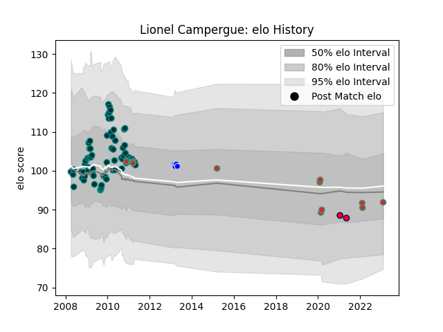

---  
layout: page  
title: Lionel Campergue  
date: 2022-11-22 11:35:56.492043  
categories: player  
---
# Lionel Campergue

## Positions: H

## Country: Portugal

## Current elo: 96.0

## Current Percentile: 57.0

# Elo History

# Match History

| Team                       |   Appearances |   Win Rate |
|:---------------------------|--------------:|-----------:|
| Pau                        |            40 |   0.5625   |
| Portugal                   |             4 |   0.375    |
| Colomiers                  |             3 |   0.333333 |
| Cognac Saint Jean d'Angély |             2 |   1        |

| Opponent        |   Matches |   Win Rate |
|:----------------|----------:|-----------:|
| Oyonnax         |         5 |   0.6      |
| Auch            |         4 |   0.625    |
| Aurillac        |         4 |   0.5      |
| Tarbes          |         4 |   0.5      |
| Bordeaux Begles |         3 |   0.333333 |
| Colomiers       |         3 |   0.666667 |
| Agen            |         2 |   0.25     |
| Albi            |         2 |   0.5      |
| Provence Rugby  |         2 |   1        |
| Mont-de-Marsan  |         2 |   0.5      |
| Lyon            |         2 |   0.75     |
| La Rochelle     |         2 |   0.5      |
| Dax             |         2 |   1        |
| Grenoble        |         1 |   0        |
| Lannemezan      |         1 |   1        |
| Georgia         |         1 |   0.5      |
| Narbonne        |         1 |   1        |
| Carcassonne     |         1 |   0        |
| Brive           |         1 |   0        |
| Romania         |         1 |   0        |
| Russia          |         1 |   0        |
| Saint-Etienne   |         1 |   1        |
| Suresnes        |         1 |   1        |
| Belgium         |         1 |   1        |
| US Bressane     |         1 |   0        |