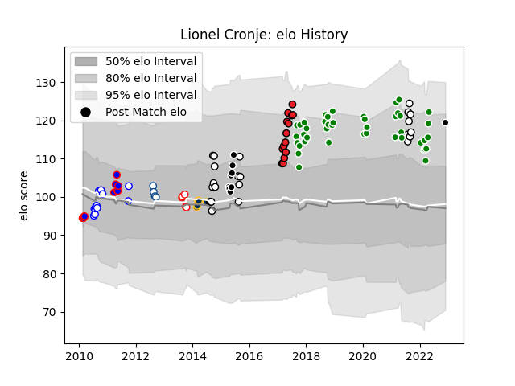

---  
layout: page  
title: Lionel Cronje  
date: 2023-03-21 17:57:21.168098  
categories: player  
---
# Lionel Cronje

Last updated: 2023-03-21
## Positions: FH

## Current elo: 119.0

## Current Percentile: 90.0

# Elo History

# Match History

| Team             |   Appearances |   Win Rate |
|:-----------------|--------------:|-----------:|
| Toyota Verblitz  |            43 |   0.616279 |
| Natal Sharks     |            24 |   0.645833 |
| Southern Kings   |            14 |   0.428571 |
| Western Province |            12 |   0.75     |
| Stormers         |            11 |   0.727273 |
| Sharks           |             9 |   0.333333 |
| Brumbies         |             6 |   0.666667 |
| Golden Lions     |             5 |   0.6      |
| Blue Bulls       |             4 |   0.25     |

| Opponent                          |   Matches |   Win Rate |
|:----------------------------------|----------:|-----------:|
| Griquas                           |         8 |   0.625    |
| Free State Cheetahs               |         7 |   0.642857 |
| Blue Bulls                        |         6 |   0.833333 |
| Saitama Wild Knights              |         6 |   0.166667 |
| Golden Lions                      |         5 |   0.6      |
| Natal Sharks                      |         5 |   0.4      |
| New South Wales Waratahs          |         5 |   0.6      |
| Tokyo Sungoliath                  |         5 |   0        |
| Pumas                             |         5 |   0.6      |
| Kubota Spears Funabashi Tokyo-Bay |         4 |   0.75     |
| Lions                             |         4 |   0.5      |
| Shizuoka Blue Revs                |         4 |   0.25     |
| Urayasu D-Rocks                   |         4 |   1        |
| Western Province                  |         4 |   0.25     |
| Eastern Province Kings            |         3 |   1        |
| Sharks                            |         3 |   0.666667 |
| Queensland Reds                   |         3 |   0.333333 |
| Stormers                          |         3 |   0.666667 |
| Hurricanes                        |         3 |   0.666667 |
| NTT Docomo Red Hurricanes Osaka   |         3 |   1        |
| Western Force                     |         3 |   0.666667 |
| Melbourne Rebels                  |         2 |   1        |
| Toshiba Brave Lupus Tokyo         |         2 |   1        |
| Black Rams Tokyo                  |         2 |   1        |
| Leopards                          |         2 |   1        |
| Yokohama Canon Eagles             |         2 |   0.5      |
| Kobelco Kobe Steelers             |         2 |   0.25     |
| Jaguares                          |         2 |   0.5      |
| Hino Red Dolphins                 |         2 |   1        |
| Highlanders                       |         2 |   0.5      |
| Green Rockets Tokatsu             |         2 |   1        |
| Brumbies                          |         2 |   0        |
| Bulls                             |         2 |   0.5      |
| Cheetahs                          |         1 |   0        |
| Blues                             |         1 |   1        |
| Toyota Industries Shuttles Aichi  |         1 |   1        |
| Cardiff Blues                     |         1 |   0        |
| Mie Honda Heat                    |         1 |   1        |
| Sunwolves                         |         1 |   1        |
| Chiefs                            |         1 |   0        |
| Munakata Sanix Blues              |         1 |   1        |
| Crusaders                         |         1 |   0        |
| Hanazono Kintetsu Liners          |         1 |   1        |
| Coca-Cola Red Sparks              |         1 |   1        |