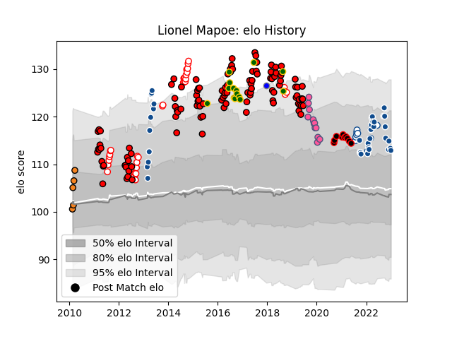

---  
layout: page  
title: Lionel Mapoe  
date: 2023-02-02 18:46:55.500416  
categories: player  
---
# Lionel Mapoe

## Positions: C, W

## Country: South Africa

## Current elo: 113.0

## Current Percentile: 86.0

# Elo History

# Match History

| Team                              |   Appearances |   Win Rate |
|:----------------------------------|--------------:|-----------:|
| Lions                             |           109 |   0.541284 |
| Bulls                             |            40 |   0.65     |
| Golden Lions                      |            35 |   0.685714 |
| South Africa                      |            14 |   0.428571 |
| Stade Francais Paris              |            13 |   0.307692 |
| Blue Bulls                        |            10 |   0.9      |
| Nice                              |            10 |   0.7      |
| Cheetahs                          |             5 |   0.4      |
| Kubota Spears Funabashi Tokyo-Bay |             2 |   1        |

| Opponent                   |   Matches |   Win Rate |
|:---------------------------|----------:|-----------:|
| Sharks                     |        17 |   0.529412 |
| Stormers                   |        14 |   0.357143 |
| Bulls                      |        12 |   0.416667 |
| Cheetahs                   |        11 |   0.818182 |
| Western Province           |        10 |   0.5      |
| Crusaders                  |         9 |   0.111111 |
| Hurricanes                 |         8 |   0.375    |
| New South Wales Waratahs   |         8 |   0.75     |
| Free State Cheetahs        |         7 |   0.857143 |
| Natal Sharks               |         7 |   0.571429 |
| Highlanders                |         6 |   0.5      |
| Jaguares                   |         6 |   0.833333 |
| Griquas                    |         6 |   0.833333 |
| Brumbies                   |         6 |   0.333333 |
| Queensland Reds            |         6 |   0.5      |
| Blues                      |         6 |   0.5      |
| Blue Bulls                 |         6 |   0.666667 |
| Pumas                      |         5 |   1        |
| Chiefs                     |         5 |   0.4      |
| Melbourne Rebels           |         5 |   1        |
| Southern Kings             |         4 |   1        |
| Sunwolves                  |         4 |   1        |
| Western Force              |         4 |   0.5      |
| Argentina                  |         4 |   0.5      |
| Lions                      |         3 |   1        |
| Ireland                    |         3 |   0.666667 |
| Zebre                      |         3 |   0.666667 |
| Brive                      |         3 |   0        |
| Connacht                   |         2 |   0.5      |
| Munster                    |         2 |   0.5      |
| Glasgow Warriors           |         2 |   0.5      |
| Golden Lions               |         2 |   1        |
| Edinburgh                  |         2 |   0.5      |
| Eastern Province Kings     |         2 |   1        |
| Australia                  |         2 |   0.5      |
| New Zealand                |         2 |   0        |
| Cardiff Blues              |         2 |   1        |
| La Rochelle                |         2 |   0.5      |
| Tarbes                     |         2 |   0.75     |
| Lyon                       |         2 |   0        |
| Scarlets                   |         2 |   0.5      |
| Racing 92                  |         1 |   0        |
| Bourgoin-Jallieu           |         1 |   1        |
| Exeter Chiefs              |         1 |   1        |
| Bordeaux Begles            |         1 |   0        |
| Benetton Treviso           |         1 |   1        |
| Bayonne                    |         1 |   1        |
| Ulster                     |         1 |   1        |
| Wales                      |         1 |   0        |
| Aubenas                    |         1 |   1        |
| Bristol Rugby              |         1 |   0        |
| Coca-Cola Red Sparks       |         1 |   1        |
| Pau                        |         1 |   1        |
| Ospreys                    |         1 |   1        |
| France                     |         1 |   1        |
| Narbonne                   |         1 |   0        |
| Munakata Sanix Blues       |         1 |   1        |
| Cognac Saint Jean d'Angély |         1 |   1        |
| Massy                      |         1 |   1        |
| Leinster                   |         1 |   0        |
| Dax                        |         1 |   0        |
| Dijon                      |         1 |   1        |
| Dragons                    |         1 |   1        |
| England                    |         1 |   0        |
| Albi                       |         1 |   0.5      |