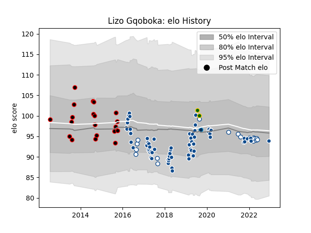

---  
layout: page  
title: Lizo Gqoboka  
date: 2022-12-14 11:31:10.534814  
categories: player  
---
# Lizo Gqoboka

## Positions: P

## Country: South Africa

## Current elo: 94.0

## Current Percentile: 42.0

# Elo History

# Match History

| Team                   |   Appearances |   Win Rate |
|:-----------------------|--------------:|-----------:|
| Bulls                  |            67 |   0.440299 |
| Eastern Province Kings |            20 |   0.35     |
| Blue Bulls             |            19 |   0.736842 |
| South Africa           |             2 |   1        |
| Montpellier Herault    |             1 |   0        |

| Opponent                 |   Matches |   Win Rate |
|:-------------------------|----------:|-----------:|
| Stormers                 |         8 |   0.375    |
| Sharks                   |         8 |   0.6875   |
| Pumas                    |         8 |   0.625    |
| Lions                    |         7 |   0.571429 |
| Natal Sharks             |         6 |   0.166667 |
| Jaguares                 |         5 |   0.2      |
| Golden Lions             |         5 |   0.6      |
| Western Province         |         4 |   0.25     |
| Queensland Reds          |         4 |   0.5      |
| Highlanders              |         4 |   0.375    |
| Free State Cheetahs      |         3 |   0.333333 |
| Sunwolves                |         3 |   0.666667 |
| Melbourne Rebels         |         3 |   1        |
| Hurricanes               |         3 |   0.333333 |
| Griquas                  |         3 |   1        |
| Blues                    |         3 |   0.166667 |
| Crusaders                |         3 |   0        |
| Chiefs                   |         3 |   0        |
| Cheetahs                 |         3 |   0.666667 |
| Blue Bulls               |         3 |   0        |
| Border Bulldogs          |         3 |   1        |
| New South Wales Waratahs |         2 |   0.5      |
| Brumbies                 |         2 |   0        |
| Boland Cavaliers         |         2 |   1        |
| Western Force            |         1 |   1        |
| Valke                    |         1 |   1        |
| Australia                |         1 |   1        |
| Southern Kings           |         1 |   0        |
| Edinburgh                |         1 |   0        |
| Eastern Province Kings   |         1 |   1        |
| Cardiff Blues            |         1 |   1        |
| Lyon                     |         1 |   1        |
| Connacht                 |         1 |   0        |
| Argentina                |         1 |   1        |
| Agen                     |         1 |   0        |