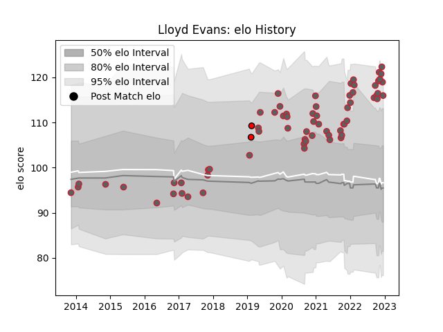

---  
layout: page  
title: Lloyd Evans  
date: 2022-11-22 11:40:53.317541  
categories: player  
---
# Lloyd Evans

## Positions: FH, FB

## Current elo: 121.0

## Current Percentile: 94.0

# Elo History

# Match History

| Team             |   Appearances |   Win Rate |
|:-----------------|--------------:|-----------:|
| Gloucester Rugby |            62 |   0.427419 |
| Hartpury College |             2 |   0.5      |

| Opponent            |   Matches |   Win Rate |
|:--------------------|----------:|-----------:|
| Newcastle Falcons   |         8 |   0.625    |
| London Irish        |         6 |   0.833333 |
| Bath Rugby          |         5 |   0.5      |
| Wasps               |         5 |   0.8      |
| Sale Sharks         |         5 |   0.2      |
| Northampton Saints  |         5 |   0        |
| Leicester Tigers    |         5 |   0.2      |
| Saracens            |         4 |   0.5      |
| Exeter Chiefs       |         4 |   0.25     |
| Harlequins          |         3 |   0        |
| Bristol Rugby       |         3 |   0.666667 |
| Worcester Warriors  |         2 |   0.5      |
| Montpellier Herault |         1 |   0        |
| Dragons             |         1 |   1        |
| Richmond            |         1 |   1        |
| Coventry            |         1 |   0        |
| Connacht            |         1 |   0        |
| Scarlets            |         1 |   0        |
| Stade Toulousain    |         1 |   0        |
| Castres Olympique   |         1 |   0        |
| London Welsh        |         1 |   1        |