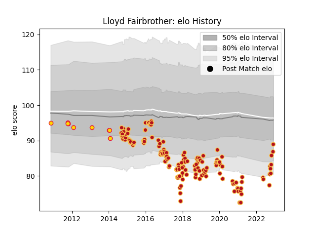

---  
layout: page  
title: Lloyd Fairbrother  
date: 2022-12-12 15:28:39.136408  
categories: player  
---
# Lloyd Fairbrother

## Positions: P

## Current elo: 89.0

## Current Percentile: 14.0

# Elo History

# Match History

| Team          |   Appearances |   Win Rate |
|:--------------|--------------:|-----------:|
| Dragons       |           154 |   0.288961 |
| Exeter Chiefs |             9 |   0.555556 |

| Opponent             |   Matches |   Win Rate |
|:---------------------|----------:|-----------:|
| Ospreys              |        15 |   0.333333 |
| Edinburgh            |        13 |   0.307692 |
| Cardiff Blues        |        12 |   0.166667 |
| Glasgow Warriors     |        10 |   0.25     |
| Benetton Treviso     |        10 |   0.3      |
| Scarlets             |        10 |   0.3      |
| Ulster               |         9 |   0.166667 |
| Munster              |         9 |   0.222222 |
| Leinster             |         9 |   0        |
| Zebre                |         9 |   0.444444 |
| Connacht             |         7 |   0.285714 |
| RC Enisei            |         6 |   0.833333 |
| Newcastle Falcons    |         5 |   0.2      |
| Northampton Saints   |         5 |   0.2      |
| Southern Kings       |         4 |   0.625    |
| Castres Olympique    |         3 |   0.333333 |
| Cheetahs             |         3 |   0.333333 |
| Bordeaux Begles      |         2 |   0.5      |
| Saracens             |         2 |   0        |
| Pau                  |         2 |   1        |
| Stade Francais Paris |         2 |   1        |
| Lions                |         2 |   0        |
| Timisoara Saracens   |         1 |   1        |
| Sharks               |         1 |   0        |
| Stormers             |         1 |   0        |
| Wasps                |         1 |   1        |
| Worcester Warriors   |         1 |   1        |
| Bath Rugby           |         1 |   0        |
| Harlequins           |         1 |   0        |
| Gloucester Rugby     |         1 |   0        |
| Exeter Chiefs        |         1 |   0        |
| Clermont Auvergne    |         1 |   0        |
| Bucuresti            |         1 |   1        |
| Brive                |         1 |   0        |
| Bristol Rugby        |         1 |   0        |
| Montpellier Herault  |         1 |   0        |