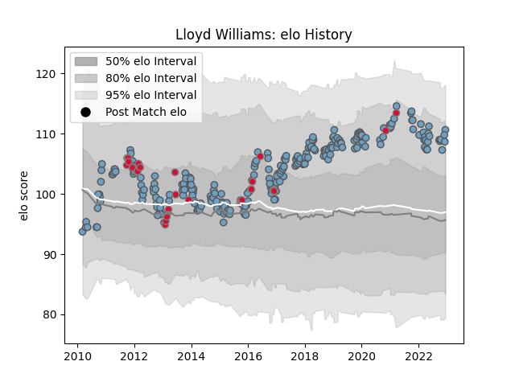

---  
layout: page  
title: Lloyd Williams  
date: 2022-12-14 11:15:05.942095  
categories: player  
---
# Lloyd Williams

## Positions: SH

## Country: Wales

## Current elo: 111.0

## Current Percentile: 85.0

# Elo History

# Match History

| Team          |   Appearances |   Win Rate |
|:--------------|--------------:|-----------:|
| Cardiff Blues |           252 |   0.501984 |
| Wales         |            32 |   0.703125 |

| Opponent            |   Matches |   Win Rate |
|:--------------------|----------:|-----------:|
| Scarlets            |        24 |  0.375     |
| Dragons             |        21 |  0.857143  |
| Ospreys             |        21 |  0.166667  |
| Edinburgh           |        19 |  0.631579  |
| Glasgow Warriors    |        18 |  0.222222  |
| Munster             |        14 |  0.357143  |
| Benetton Treviso    |        14 |  0.714286  |
| Connacht            |        14 |  0.714286  |
| Leinster            |        13 |  0.0769231 |
| Zebre               |        13 |  0.769231  |
| Ulster              |        12 |  0.291667  |
| Cheetahs            |         5 |  0.6       |
| Pau                 |         5 |  0.8       |
| Calvisano           |         4 |  1         |
| Scotland            |         4 |  0.75      |
| England             |         4 |  0.75      |
| Sale Sharks         |         4 |  0.5       |
| France              |         4 |  0.75      |
| Bath Rugby          |         4 |  0.25      |
| Ireland             |         4 |  0.625     |
| London Irish        |         4 |  0.75      |
| Southern Kings      |         3 |  1         |
| Toulon              |         3 |  0.333333  |
| Montpellier Herault |         3 |  0.333333  |
| Leicester Tigers    |         3 |  0         |
| Harlequins          |         3 |  0.333333  |
| Australia           |         3 |  0         |
| Japan               |         3 |  0.666667  |
| Exeter Chiefs       |         3 |  0.166667  |
| Racing 92           |         2 |  1         |
| Rovigo              |         2 |  1         |
| Bristol Rugby       |         2 |  1         |
| South Africa        |         2 |  0.5       |
| Sharks              |         2 |  1         |
| Bulls               |         2 |  0         |
| Stade Toulousain    |         2 |  1         |
| Fiji                |         2 |  1         |
| Gloucester Rugby    |         2 |  0.5       |
| Grenoble            |         2 |  1         |
| Lyon                |         2 |  1         |
| Italy               |         2 |  1         |
| Lions               |         2 |  0         |
| Tonga               |         1 |  1         |
| Uruguay             |         1 |  1         |
| Argentina           |         1 |  1         |
| Saracens            |         1 |  0         |
| Stormers            |         1 |  0         |
| Brive               |         1 |  1         |
| Castres Olympique   |         1 |  0         |
| Namibia             |         1 |  1         |
| Aironi              |         1 |  1         |