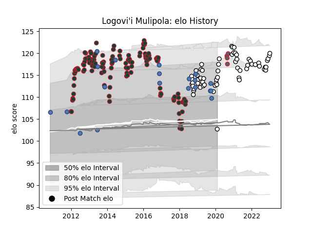

---  
layout: page  
title: Logovi'i Mulipola  
date: 2022-11-22 11:27:55.540535  
categories: player  
---
# Logovi'i Mulipola

## Positions: P

## Country: Samoa

## Current elo: 109.0

## Current Percentile: None

# Elo History

# Match History

| Team              |   Appearances |   Win Rate |
|:------------------|--------------:|-----------:|
| Leicester Tigers  |           135 |   0.648148 |
| Newcastle Falcons |            56 |   0.446429 |
| Samoa             |            18 |   0.444444 |
| Gloucester Rugby  |             4 |   0.25     |

| Opponent                 |   Matches |   Win Rate |
|:-------------------------|----------:|-----------:|
| Northampton Saints       |        18 |   0.638889 |
| Harlequins               |        17 |   0.411765 |
| Saracens                 |        16 |   0.28125  |
| Exeter Chiefs            |        16 |   0.5      |
| Gloucester Rugby         |        14 |   0.642857 |
| Wasps                    |        13 |   0.615385 |
| Sale Sharks              |        12 |   0.666667 |
| London Irish             |        11 |   0.818182 |
| Worcester Warriors       |        10 |   1        |
| Newcastle Falcons        |        10 |   0.8      |
| Bath Rugby               |         9 |   0.444444 |
| Bristol Rugby            |         6 |   0.166667 |
| Munster                  |         4 |   0.25     |
| Leicester Tigers         |         4 |   0        |
| Benetton Treviso         |         4 |   1        |
| Racing 92                |         3 |   0.333333 |
| London Welsh             |         3 |   1        |
| Georgia                  |         2 |   0        |
| Ospreys                  |         2 |   0.75     |
| Ulster                   |         2 |   0        |
| Toulon                   |         2 |   0.5      |
| Stade Toulousain         |         2 |   0.5      |
| Stade Francais Paris     |         2 |   0.5      |
| Ireland                  |         2 |   0        |
| Scarlets                 |         2 |   0.5      |
| South Africa             |         2 |   0        |
| Scotland                 |         2 |   0.5      |
| Germany                  |         2 |   1        |
| Russia                   |         1 |   1        |
| Spain                    |         1 |   1        |
| United States of America |         1 |   0        |
| Australia                |         1 |   0        |
| Nottingham               |         1 |   1        |
| Doncaster                |         1 |   1        |
| Bedford                  |         1 |   1        |
| Canada                   |         1 |   1        |
| Cardiff Blues            |         1 |   1        |
| Clermont Auvergne        |         1 |   0        |
| Cornish Pirates          |         1 |   1        |
| Coventry                 |         1 |   1        |
| Ealing Trailfinders      |         1 |   1        |
| Montpellier Herault      |         1 |   1        |
| France                   |         1 |   0        |
| Glasgow Warriors         |         1 |   0        |
| Hartpury College         |         1 |   1        |
| Italy                    |         1 |   1        |
| Japan                    |         1 |   1        |
| Jersey                   |         1 |   1        |
| Yorkshire Carnegie       |         1 |   1        |