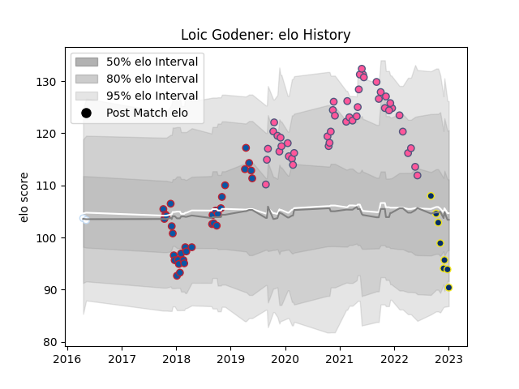

---  
layout: page  
title: Loic Godener  
date: 2023-01-06 00:26:36.628601  
categories: player  
---
# Loic Godener

## Positions: N8, FL

## Current elo: 90.0

## Current Percentile: 22.0

# Elo History

# Match History

| Team                 |   Appearances |   Win Rate |
|:---------------------|--------------:|-----------:|
| Stade Francais Paris |            46 |   0.369565 |
| Grenoble             |            33 |   0.5      |
| Clermont Auvergne    |             8 |   0.1875   |
| Racing 92            |             2 |   0        |

| Opponent             |   Matches |   Win Rate |
|:---------------------|----------:|-----------:|
| Racing 92            |         8 |   0.125    |
| Brive                |         7 |   0.142857 |
| La Rochelle          |         7 |   0.428571 |
| Lyon                 |         6 |   0.166667 |
| Agen                 |         5 |   0.5      |
| Stade Toulousain     |         5 |   0.2      |
| Bayonne              |         5 |   0.6      |
| Pau                  |         5 |   0.4      |
| Toulon               |         4 |   0.5      |
| Bordeaux Begles      |         4 |   0.625    |
| Clermont Auvergne    |         4 |   0.125    |
| Montpellier Herault  |         4 |   0.5      |
| Biarritz Olympique   |         3 |   0.333333 |
| Colomiers            |         2 |   0.5      |
| Perpignan            |         2 |   0.5      |
| Stade Francais Paris |         2 |   0.5      |
| Vannes               |         2 |   1        |
| Soyaux-Angouleme     |         2 |   1        |
| Narbonne             |         2 |   0.75     |
| Nevers               |         2 |   0.5      |
| Massy                |         1 |   0        |
| Montauban            |         1 |   1        |
| Aurillac             |         1 |   0        |
| Dax                  |         1 |   1        |
| Connacht             |         1 |   0        |
| Bristol Rugby        |         1 |   0        |
| Beziers              |         1 |   0        |
| Zebre                |         1 |   1        |