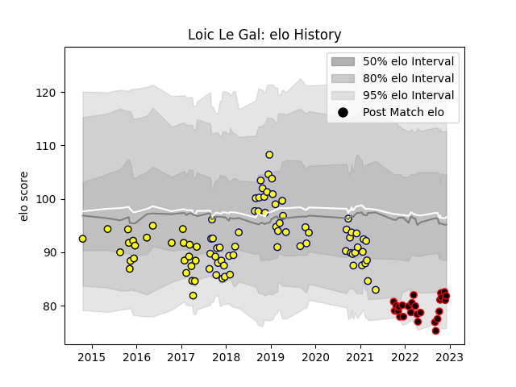

---  
layout: page  
title: Loic Le Gal  
date: 2023-01-23 15:29:08.815092  
categories: player  
---
# Loic Le Gal

## Positions: FB

## Current elo: 68.0

## Current Percentile: 6.0

# Elo History

# Match History

| Team   |   Appearances |   Win Rate |
|:-------|--------------:|-----------:|
| Nevers |            67 |   0.492537 |
| Albi   |            36 |   0.416667 |
| Nice   |            30 |   0.616667 |

| Opponent                   |   Matches |   Win Rate |
|:---------------------------|----------:|-----------:|
| Carcassonne                |         9 |   0.611111 |
| Vannes                     |         7 |   0.5      |
| Beziers                    |         7 |   0.285714 |
| Mont-de-Marsan             |         7 |   0.428571 |
| Colomiers                  |         7 |   0.714286 |
| Soyaux-Angouleme           |         7 |   0.428571 |
| Biarritz Olympique         |         6 |   0.666667 |
| Provence Rugby             |         6 |   0.5      |
| Oyonnax                    |         6 |   0.166667 |
| Aurillac                   |         6 |   0.333333 |
| Montauban                  |         6 |   0.333333 |
| Perpignan                  |         5 |   0.4      |
| Grenoble                   |         4 |   0.25     |
| Narbonne                   |         4 |   0.75     |
| Massy                      |         4 |   0.5      |
| Dax                        |         4 |   0.5      |
| Valence Romans Drome Rugby |         4 |   0.25     |
| Bayonne                    |         4 |   0.25     |
| Bourgoin-Jallieu           |         4 |   0.5      |
| Suresnes                   |         3 |   0.666667 |
| US Bressane                |         3 |   0.333333 |
| Tarbes                     |         3 |   1        |
| Albi                       |         2 |   0.75     |
| Blagnac                    |         2 |   1        |
| Aubenas                    |         2 |   1        |
| Cognac Saint Jean d'Angély |         2 |   1        |
| Pau                        |         2 |   0.5      |
| Dijon                      |         2 |   0.5      |
| Agen                       |         1 |   1        |
| Rouen                      |         1 |   0        |
| Rennes                     |         1 |   1        |
| Chambery                   |         1 |   1        |
| Lyon                       |         1 |   0        |