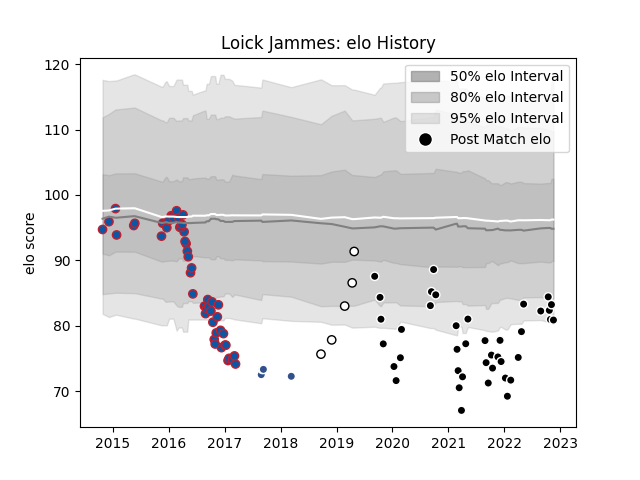

---  
layout: page  
title: Loick Jammes  
date: 2023-02-02 18:48:55.776814  
categories: player  
---
# Loick Jammes

## Positions: H

## Current elo: 59.0

## Current Percentile: 0.0

# Elo History

# Match History

| Team           |   Appearances |   Win Rate |
|:---------------|--------------:|-----------:|
| Provence Rugby |            66 |   0.545455 |
| Grenoble       |            51 |   0.352941 |
| Brive          |            17 |   0.647059 |
| Agen           |             4 |   0.25     |

| Opponent             |   Matches |   Win Rate |
|:---------------------|----------:|-----------:|
| Oyonnax              |        11 |   0.454545 |
| Montauban            |         8 |   0.75     |
| Mont-de-Marsan       |         8 |   0.5      |
| Nevers               |         7 |   0.571429 |
| Vannes               |         7 |   0.714286 |
| Colomiers            |         6 |   0.333333 |
| Agen                 |         5 |   0.8      |
| Rouen                |         5 |   0.6      |
| Grenoble             |         5 |   0.7      |
| Lyon                 |         4 |   0        |
| US Bressane          |         4 |   0.625    |
| Stade Toulousain     |         4 |   0.5      |
| Soyaux-Angouleme     |         4 |   0.5      |
| Racing 92            |         4 |   0.5      |
| Beziers              |         4 |   0.5      |
| Carcassonne          |         4 |   0.75     |
| Brive                |         4 |   0.5      |
| London Irish         |         4 |   0.5      |
| Bordeaux Begles      |         3 |   0        |
| Toulon               |         3 |   0        |
| Montpellier Herault  |         3 |   0        |
| La Rochelle          |         3 |   0.333333 |
| Edinburgh            |         2 |   0.5      |
| Castres Olympique    |         2 |   0        |
| Stade Francais Paris |         2 |   0.5      |
| Clermont Auvergne    |         2 |   0        |
| Roval Drome XV       |         2 |   1        |
| Perpignan            |         2 |   0.5      |
| Pau                  |         2 |   0        |
| Bayonne              |         2 |   1        |
| Aurillac             |         2 |   0.5      |
| Narbonne             |         2 |   0        |
| Massy                |         1 |   1        |
| Provence Rugby       |         1 |   0        |
| Connacht             |         1 |   1        |
| Rovigo               |         1 |   1        |
| Ospreys              |         1 |   0        |
| Newcastle Falcons    |         1 |   0        |
| Harlequins           |         1 |   0        |
| Cardiff Blues        |         1 |   0        |