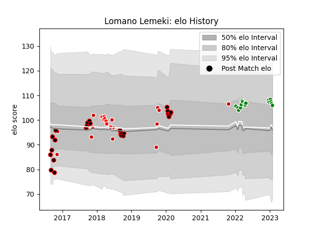

---  
layout: page  
title: Lomano Lemeki  
date: 2023-01-13 11:32:43.342955  
categories: player  
---
# Lomano Lemeki

## Positions: W, FB

## Country: Japan

## Current elo: 108.0

## Current Percentile: 77.0

# Elo History

# Match History

| Team                  |   Appearances |   Win Rate |
|:----------------------|--------------:|-----------:|
| Mie Honda Heat        |            25 |  0.34      |
| Green Rockets Tokatsu |            13 |  0.0769231 |
| Japan                 |            13 |  0.576923  |
| Sunwolves             |             7 |  0         |

| Opponent                          |   Matches |   Win Rate |
|:----------------------------------|----------:|-----------:|
| Kubota Spears Funabashi Tokyo-Bay |         5 |   0        |
| Kobelco Kobe Steelers             |         4 |   0        |
| Yokohama Canon Eagles             |         3 |   0.5      |
| Shizuoka Blue Revs                |         3 |   0        |
| Black Rams Tokyo                  |         3 |   0.333333 |
| Toshiba Brave Lupus Tokyo         |         3 |   0        |
| Australia                         |         2 |   0        |
| Italy                             |         2 |   0.5      |
| Georgia                           |         2 |   1        |
| Coca-Cola Red Sparks              |         2 |   0.5      |
| Tokyo Sungoliath                  |         2 |   0        |
| Toyota Verblitz                   |         2 |   0        |
| Urayasu D-Rocks                   |         2 |   0        |
| South Africa                      |         1 |   0        |
| NTT Docomo Red Hurricanes Osaka   |         1 |   0        |
| Sharks                            |         1 |   0        |
| Samoa                             |         1 |   1        |
| Tonga                             |         1 |   1        |
| Saitama Wild Knights              |         1 |   0        |
| Russia                            |         1 |   1        |
| New South Wales Waratahs          |         1 |   0        |
| Argentina                         |         1 |   0        |
| Munakata Sanix Blues              |         1 |   0        |
| Melbourne Rebels                  |         1 |   0        |
| Mazda Blue Zoomers                |         1 |   1        |
| Kyuden Voltex                     |         1 |   1        |
| Kamaishi Seawaves                 |         1 |   1        |
| Ireland                           |         1 |   1        |
| Hanazono Kintetsu Liners          |         1 |   1        |
| France                            |         1 |   0.5      |
| Chugoku Red Regulions             |         1 |   1        |
| Chubu Electric Power              |         1 |   1        |
| Chiefs                            |         1 |   0        |
| Brumbies                          |         1 |   0        |
| Blues                             |         1 |   0        |
| Lions                             |         1 |   0        |