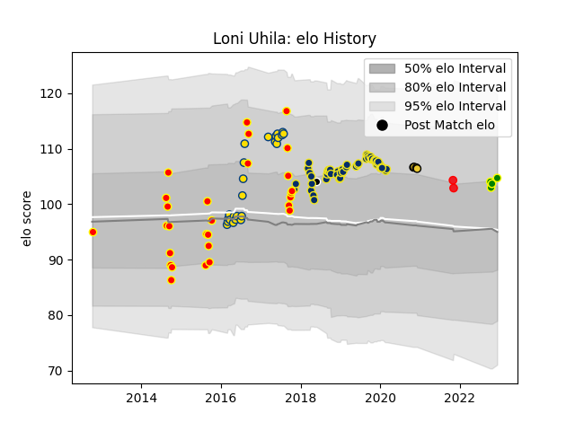

---  
layout: page  
title: Loni Uhila  
date: 2023-03-09 10:08:44.436716  
categories: player  
---
# Loni Uhila

## Positions: P

## Country: Tonga

## Current elo: 104.0

## Current Percentile: 72.0

# Elo History

# Match History

| Team                |   Appearances |   Win Rate |
|:--------------------|--------------:|-----------:|
| Clermont Auvergne   |            52 |   0.644231 |
| Waikato             |            28 |   0.464286 |
| Hurricanes          |            24 |   0.708333 |
| La Rochelle         |             4 |   0.75     |
| Carqueiranne-Hyères |             3 |   0.666667 |
| Tonga               |             2 |   0        |
| Barbarians          |             1 |   1        |

| Opponent                 |   Matches |   Win Rate |
|:-------------------------|----------:|-----------:|
| Lyon                     |         5 |   0.6      |
| Pau                      |         5 |   0.8      |
| Chiefs                   |         4 |   0.25     |
| Stade Toulousain         |         4 |   0.375    |
| Montpellier Herault      |         4 |   0.5      |
| Manawatu                 |         4 |   0.5      |
| Agen                     |         4 |   0.75     |
| Bordeaux Begles          |         4 |   0.25     |
| Brive                    |         3 |   0.666667 |
| Crusaders                |         3 |   0.666667 |
| Tasman                   |         3 |   0        |
| Stade Francais Paris     |         3 |   0.666667 |
| Racing 92                |         3 |   0.333333 |
| Bay of Plenty            |         3 |   0.666667 |
| Auckland                 |         3 |   0.333333 |
| Lions                    |         3 |   0.666667 |
| La Rochelle              |         3 |   0.666667 |
| North Harbour            |         3 |   0.666667 |
| Counties Manukau         |         3 |   1        |
| Dragons                  |         2 |   1        |
| Brumbies                 |         2 |   0.5      |
| Wellington               |         2 |   0.5      |
| Ulster                   |         2 |   0.5      |
| Toulon                   |         2 |   0.5      |
| Bath Rugby               |         2 |   1        |
| Canterbury               |         2 |   0        |
| Castres Olympique        |         2 |   0.5      |
| England                  |         2 |   0.5      |
| Western Force            |         2 |   1        |
| Harlequins               |         2 |   1        |
| Blues                    |         2 |   1        |
| Highlanders              |         2 |   0.5      |
| New South Wales Waratahs |         1 |   1        |
| Clermont Auvergne        |         1 |   1        |
| Grenoble                 |         1 |   1        |
| US Bressane              |         1 |   0        |
| Hawke's Bay              |         1 |   1        |
| Timisoara Saracens       |         1 |   1        |
| Bulls                    |         1 |   1        |
| Tarbes                   |         1 |   1        |
| Taranaki                 |         1 |   0        |
| Southland                |         1 |   1        |
| Bayonne                  |         1 |   1        |
| Southern Kings           |         1 |   1        |
| Sharks                   |         1 |   1        |
| Scotland                 |         1 |   0        |
| Cheetahs                 |         1 |   1        |
| Queensland Reds          |         1 |   1        |
| Chambery                 |         1 |   1        |
| Otago                    |         1 |   0        |
| Northland                |         1 |   0        |
| Northampton Saints       |         1 |   1        |
| Perpignan                |         1 |   1        |