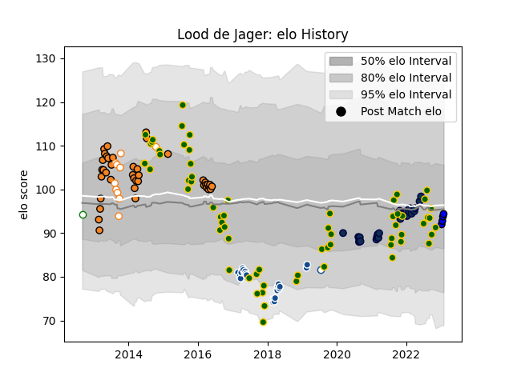

---  
layout: page  
title: Lood de Jager  
date: 2023-01-13 11:29:14.971605  
categories: player  
---
# Lood de Jager

## Positions: L

## Country: South Africa

## Current elo: 92.0

## Current Percentile: 36.0

# Elo History

# Match History

| Team                 |   Appearances |   Win Rate |
|:---------------------|--------------:|-----------:|
| South Africa         |            65 |   0.576923 |
| Cheetahs             |            40 |   0.3875   |
| Sale Sharks          |            23 |   0.565217 |
| Bulls                |            22 |   0.363636 |
| Free State Cheetahs  |            10 |   0.4      |
| Blue Bulls           |             1 |   0        |
| Leopards             |             1 |   1        |
| Saitama Wild Knights |             1 |   1        |

| Opponent                 |   Matches |   Win Rate |
|:-------------------------|----------:|-----------:|
| Argentina                |        11 |   0.818182 |
| Wales                    |        10 |   0.7      |
| New Zealand              |        10 |   0.2      |
| Australia                |         9 |   0.388889 |
| Stormers                 |         7 |   0.285714 |
| Sharks                   |         7 |   0.714286 |
| Lions                    |         5 |   0        |
| Chiefs                   |         4 |   0.125    |
| Italy                    |         4 |   0.75     |
| Melbourne Rebels         |         4 |   0.5      |
| England                  |         4 |   0.25     |
| Queensland Reds          |         4 |   0.25     |
| Bulls                    |         4 |   0.25     |
| Scotland                 |         4 |   1        |
| Hurricanes               |         4 |   0.25     |
| Ireland                  |         3 |   0        |
| London Irish             |         3 |   0.833333 |
| Southern Kings           |         3 |   1        |
| Wasps                    |         3 |   1        |
| Jaguares                 |         3 |   0.333333 |
| Western Province         |         3 |   0        |
| Leicester Tigers         |         3 |   0.666667 |
| Highlanders              |         3 |   0.333333 |
| Crusaders                |         3 |   0        |
| British and Irish Lions  |         3 |   0.666667 |
| Harlequins               |         3 |   0.333333 |
| Blues                    |         3 |   0.333333 |
| Bristol Rugby            |         3 |   0.666667 |
| Exeter Chiefs            |         2 |   0.5      |
| Natal Sharks             |         2 |   0        |
| Sunwolves                |         2 |   1        |
| France                   |         2 |   1        |
| Blue Bulls               |         2 |   0.5      |
| Golden Lions             |         2 |   0.5      |
| Griquas                  |         2 |   1        |
| Saracens                 |         2 |   0        |
| Brumbies                 |         2 |   0        |
| Japan                    |         2 |   0.5      |
| New South Wales Waratahs |         2 |   0.5      |
| Bath Rugby               |         1 |   0.5      |
| Western Force            |         1 |   1        |
| United States of America |         1 |   1        |
| Cheetahs                 |         1 |   1        |
| Boland Cavaliers         |         1 |   1        |
| Samoa                    |         1 |   1        |
| Northampton Saints       |         1 |   0        |
| Newcastle Falcons        |         1 |   1        |
| Namibia                  |         1 |   1        |
| Mitsubishi Dynaboars     |         1 |   1        |
| Worcester Warriors       |         1 |   0        |