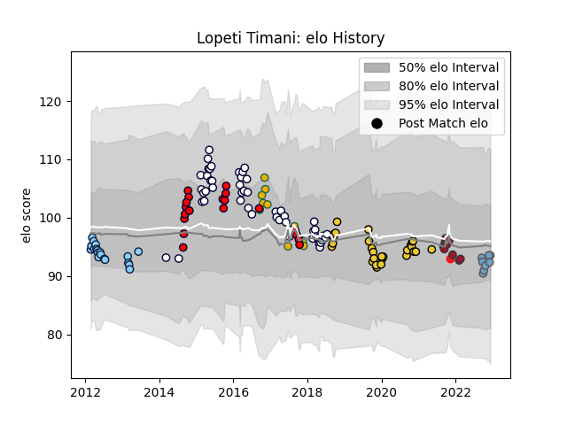

---  
layout: page  
title: Lopeti Timani  
date: 2022-12-14 11:27:33.322635  
categories: player  
---
# Lopeti Timani

## Positions: L, FL

## Country: Tonga

## Current elo: 94.0

## Current Percentile: 37.0

# Elo History

# Match History

| Team                     |   Appearances |   Win Rate |
|:-------------------------|--------------:|-----------:|
| Melbourne Rebels         |            50 |   0.4      |
| La Rochelle              |            27 |   0.592593 |
| Melbourne Rising         |            19 |   0.631579 |
| New South Wales Waratahs |            19 |   0.315789 |
| Australia                |            12 |   0.5      |
| Toulon                   |            10 |   0.5      |
| Cardiff Blues            |             8 |   0.625    |
| Tonga                    |             1 |   0        |

| Opponent                 |   Matches |   Win Rate |
|:-------------------------|----------:|-----------:|
| Brumbies                 |        10 |   0.4      |
| Western Force            |         8 |   0.625    |
| Queensland Reds          |         7 |   0.428571 |
| New South Wales Waratahs |         6 |   0.166667 |
| Bulls                    |         5 |   0.2      |
| Brive                    |         4 |   0.75     |
| Highlanders              |         4 |   0        |
| Stormers                 |         4 |   0.25     |
| Perth Spirit             |         4 |   0.25     |
| Hurricanes               |         4 |   0        |
| Stade Francais Paris     |         3 |   0.666667 |
| Sharks                   |         3 |   0.666667 |
| Stade Toulousain         |         3 |   0        |
| Perpignan                |         3 |   0.666667 |
| Pau                      |         3 |   0.833333 |
| New Zealand              |         3 |   0        |
| Sunwolves                |         3 |   1        |
| Melbourne Rebels         |         3 |   1        |
| Lyon                     |         3 |   0.333333 |
| Castres Olympique        |         3 |   0.333333 |
| Crusaders                |         3 |   0.333333 |
| Blues                    |         3 |   0.666667 |
| Canberra Vikings         |         3 |   0.333333 |
| England                  |         3 |   0        |
| Cheetahs                 |         3 |   0.333333 |
| Chiefs                   |         3 |   0.333333 |
| Clermont Auvergne        |         3 |   0.666667 |
| Toulon                   |         2 |   0.5      |
| Sydney Stars             |         2 |   1        |
| Brisbane City            |         2 |   0.5      |
| Scotland                 |         2 |   0.5      |
| Queensland Country       |         2 |   1        |
| Greater Sydney Rams      |         2 |   1        |
| NSW Country Eagles       |         2 |   1        |
| Jaguares                 |         2 |   0        |
| Exeter Chiefs            |         2 |   0        |
| Argentina                |         2 |   1        |
| Lions                    |         2 |   0        |
| Wales                    |         1 |   1        |
| Glasgow Warriors         |         1 |   0        |
| Sydney Rays              |         1 |   0        |
| Bayonne                  |         1 |   0        |
| Biarritz Olympique       |         1 |   1        |
| Italy                    |         1 |   1        |
| Bordeaux Begles          |         1 |   1        |
| Japan                    |         1 |   1        |
| North Harbour Rays       |         1 |   1        |
| Scarlets                 |         1 |   1        |
| Sale Sharks              |         1 |   1        |
| Racing 92                |         1 |   1        |
| RC Enisei                |         1 |   1        |
| Grenoble                 |         1 |   1        |
| Montpellier Herault      |         1 |   0.5      |
| Munster                  |         1 |   1        |
| Agen                     |         1 |   1        |