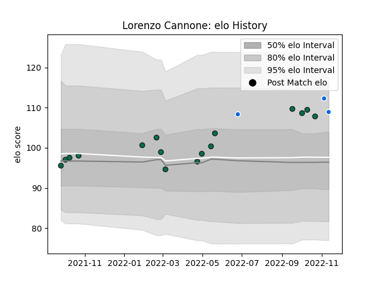

---  
layout: page  
title: Lorenzo Cannone  
date: 2023-01-13 11:39:13.010958  
categories: player  
---
# Lorenzo Cannone

## Positions: N8

## Country: Italy

## Current elo: 95.0

## Current Percentile: 39.0

# Elo History

# Match History

| Team             |   Appearances |   Win Rate |
|:-----------------|--------------:|-----------:|
| Benetton Treviso |            21 |   0.547619 |
| Italy            |             4 |   0.75     |

| Opponent             |   Matches |   Win Rate |
|:---------------------|----------:|-----------:|
| Zebre                |         2 |       1    |
| Scarlets             |         2 |       0.5  |
| Bulls                |         2 |       0    |
| Ulster               |         2 |       0.5  |
| Dragons              |         2 |       0.75 |
| Edinburgh            |         2 |       1    |
| Glasgow Warriors     |         2 |       0.5  |
| Stormers             |         1 |       1    |
| Stade Francais Paris |         1 |       0    |
| South Africa         |         1 |       0    |
| Sharks               |         1 |       0    |
| Australia            |         1 |       1    |
| Samoa                |         1 |       1    |
| Bayonne              |         1 |       1    |
| Lions                |         1 |       0    |
| Leinster             |         1 |       0    |
| Cardiff Blues        |         1 |       1    |
| Namibia              |         1 |       1    |